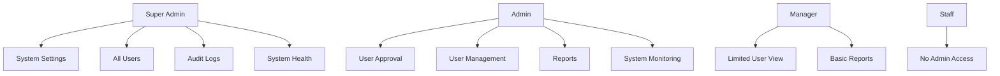

# Admin Features & User Management

## Overview

The admin system provides comprehensive user management, system monitoring, and administrative controls with robust audit trails and approval workflows.

## Admin Architecture

### Access Control Model



### Permission Matrix

| Feature | ADMIN | MANAGER | STAFF |
|---------|-------|---------|-------|
| **User Management** |
| View all users | ✅ | ✅ (limited) | ❌ |
| Approve users | ✅ | ❌ | ❌ |
| Reject users | ✅ | ❌ | ❌ |
| Suspend users | ✅ | ❌ | ❌ |
| Delete users | ✅ | ❌ | ❌ |
| **System Administration** |
| View audit logs | ✅ | ❌ | ❌ |
| System settings | ✅ | ❌ | ❌ |
| Health monitoring | ✅ | ❌ | ❌ |
| **Reports & Analytics** |
| Full reports access | ✅ | ✅ | ❌ |
| Export data | ✅ | ✅ | ❌ |

## User Management System

### User Lifecycle Management

#### User Registration Flow

```typescript
// 1. User registers
POST /api/auth/register
{
  "firstName": "John",
  "lastName": "Doe",
  "email": "john@company.com",
  "password": "SecurePass123!"
}

// 2. User status: PENDING (awaiting email verification)
// 3. User verifies email
POST /api/auth/verify-email { "token": "verification-token" }

// 4. User status: VERIFIED (awaiting admin approval)
// 5. Admin reviews and approves
POST /api/admin/approve-user { "userId": 123 }

// 6. User status: APPROVED (full access)
```

#### Admin Approval System

```typescript
interface User {
  id: number;
  firstName: string;
  lastName: string;
  email: string;
  role: UserRole;
  userStatus: UserStatus;
  emailVerified: boolean;
  
  // Approval workflow
  approvedBy?: number;        // Admin who approved
  approvedAt?: DateTime;      // When approved
  rejectionReason?: string;   // If rejected, why
  
  // Activity tracking
  lastLogin?: DateTime;
  lastLogout?: DateTime;
  lastActivity?: DateTime;
  
  // Profile
  phone?: string;
  avatarUrl?: string;
  permissions: string[];
  emailNotifications: boolean;
}
```

### User Management Interface

#### UserManagement Component (`src/components/admin/UserManagement.tsx`)

```typescript
export function UserManagement() {
  const [users, setUsers] = useState<User[]>([]);
  const [selectedUser, setSelectedUser] = useState<User | null>(null);
  const [showUserDialog, setShowUserDialog] = useState(false);
  const [filters, setFilters] = useState({
    status: 'all',
    role: 'all',
    search: ''
  });

  return (
    <div className="space-y-6">
      <div className="flex items-center justify-between">
        <PageHeader
          title="User Management"
          description="Manage user accounts, roles, and permissions"
        />
        <Button onClick={() => setShowUserDialog(true)}>
          <UserPlus className="mr-2 h-4 w-4" />
          Add User
        </Button>
      </div>

      {/* Filters */}
      <div className="flex gap-4">
        <Select value={filters.status} onValueChange={(value) => 
          setFilters(prev => ({ ...prev, status: value }))
        }>
          <SelectContent>
            <SelectItem value="all">All Statuses</SelectItem>
            <SelectItem value="PENDING">Pending</SelectItem>
            <SelectItem value="VERIFIED">Verified</SelectItem>
            <SelectItem value="APPROVED">Approved</SelectItem>
            <SelectItem value="REJECTED">Rejected</SelectItem>
            <SelectItem value="SUSPENDED">Suspended</SelectItem>
          </SelectContent>
        </Select>

        <Select value={filters.role} onValueChange={(value) => 
          setFilters(prev => ({ ...prev, role: value }))
        }>
          <SelectContent>
            <SelectItem value="all">All Roles</SelectItem>
            <SelectItem value="ADMIN">Admin</SelectItem>
            <SelectItem value="MANAGER">Manager</SelectItem>
            <SelectItem value="STAFF">Staff</SelectItem>
          </SelectContent>
        </Select>

        <Input
          placeholder="Search users..."
          value={filters.search}
          onChange={(e) => setFilters(prev => ({ ...prev, search: e.target.value }))}
        />
      </div>

      {/* User Table */}
      <DataTable
        columns={userColumns}
        data={filteredUsers}
        onRowClick={(user) => {
          setSelectedUser(user);
          setShowUserDialog(true);
        }}
      />

      {/* User Dialog */}
      <UserDialog
        user={selectedUser}
        open={showUserDialog}
        onOpenChange={setShowUserDialog}
        onUserUpdated={handleUserUpdate}
      />
    </div>
  );
}
```

#### User Table Columns

```typescript
const userColumns: ColumnDef<User>[] = [
  {
    id: 'name',
    header: 'Name',
    cell: ({ row }) => {
      const user = row.original;
      return (
        <div className="flex items-center gap-3">
          <Avatar className="h-8 w-8">
            <AvatarImage src={user.avatarUrl} alt={user.firstName} />
            <AvatarFallback>
              {user.firstName[0]}{user.lastName[0]}
            </AvatarFallback>
          </Avatar>
          <div>
            <div className="font-medium">
              {user.firstName} {user.lastName}
            </div>
            <div className="text-sm text-muted-foreground">
              {user.email}
            </div>
          </div>
        </div>
      );
    }
  },
  {
    id: 'role',
    header: 'Role',
    cell: ({ row }) => (
      <Badge variant={getRoleVariant(row.original.role)}>
        {row.original.role}
      </Badge>
    )
  },
  {
    id: 'status',
    header: 'Status',
    cell: ({ row }) => {
      const status = row.original.userStatus;
      return (
        <Badge variant={getStatusVariant(status)}>
          <StatusIcon status={status} className="mr-1 h-3 w-3" />
          {status}
        </Badge>
      );
    }
  },
  {
    id: 'lastActivity',
    header: 'Last Activity',
    cell: ({ row }) => {
      const lastActivity = row.original.lastActivity;
      return lastActivity ? (
        <time dateTime={lastActivity.toISOString()}>
          {formatDistanceToNow(lastActivity, { addSuffix: true })}
        </time>
      ) : (
        <span className="text-muted-foreground">Never</span>
      );
    }
  },
  {
    id: 'actions',
    cell: ({ row }) => (
      <UserActionDropdown user={row.original} />
    )
  }
];
```

### User Actions System

#### Approval Operations

```typescript
// Approve user API endpoint
export const POST = withPermission(['ADMIN'], async (request: AuthenticatedRequest) => {
  try {
    const body = await request.json();
    const { userId } = z.object({
      userId: z.number()
    }).parse(body);

    // Find user to approve
    const user = await prisma.user.findUnique({
      where: { id: userId }
    });

    if (!user) {
      return NextResponse.json(
        { error: 'User not found' },
        { status: 404 }
      );
    }

    if (user.userStatus !== 'VERIFIED') {
      return NextResponse.json(
        { error: 'User must be verified before approval' },
        { status: 400 }
      );
    }

    // Update user status
    const updatedUser = await prisma.user.update({
      where: { id: userId },
      data: {
        userStatus: 'APPROVED',
        approvedBy: parseInt(request.user.id),
        approvedAt: new Date()
      }
    });

    // Log audit event
    await AuditLogger.logUserEvent({
      action: 'USER_APPROVED',
      targetUserId: userId,
      adminId: parseInt(request.user.id),
      details: {
        previousStatus: user.userStatus,
        newStatus: 'APPROVED'
      }
    }, request);

    // Send approval email
    await emailService.sendUserApprovalEmail(user.email, {
      firstName: user.firstName,
      loginLink: `${getAppBaseUrl()}/login`,
      supportEmail: process.env.SUPPORT_EMAIL || 'support@company.com'
    });

    return NextResponse.json({
      success: true,
      message: 'User approved successfully',
      user: updatedUser
    });
  } catch (error) {
    return handleApiError(error);
  }
});
```

#### Rejection Operations

```typescript
export const POST = withPermission(['ADMIN'], async (request: AuthenticatedRequest) => {
  try {
    const body = await request.json();
    const { userId, reason } = z.object({
      userId: z.number(),
      reason: z.string().min(10, 'Rejection reason must be at least 10 characters')
    }).parse(body);

    const user = await prisma.user.findUnique({
      where: { id: userId }
    });

    if (!user) {
      return NextResponse.json(
        { error: 'User not found' },
        { status: 404 }
      );
    }

    // Update user status
    const updatedUser = await prisma.user.update({
      where: { id: userId },
      data: {
        userStatus: 'REJECTED',
        rejectionReason: reason,
        approvedBy: parseInt(request.user.id),
        approvedAt: new Date()
      }
    });

    // Log audit event
    await AuditLogger.logUserEvent({
      action: 'USER_REJECTED',
      targetUserId: userId,
      adminId: parseInt(request.user.id),
      details: {
        previousStatus: user.userStatus,
        newStatus: 'REJECTED',
        reason
      }
    }, request);

    // Send rejection email
    await emailService.sendUserRejectionEmail(user.email, {
      firstName: user.firstName,
      reason,
      supportEmail: process.env.SUPPORT_EMAIL || 'support@company.com'
    });

    return NextResponse.json({
      success: true,
      message: 'User rejected successfully',
      user: updatedUser
    });
  } catch (error) {
    return handleApiError(error);
  }
});
```

#### Suspension Operations

```typescript
export const POST = withPermission(['ADMIN'], async (request: AuthenticatedRequest) => {
  try {
    const body = await request.json();
    const { userId, reason } = z.object({
      userId: z.number(),
      reason: z.string().min(10, 'Suspension reason must be provided')
    }).parse(body);

    const user = await prisma.user.findUnique({
      where: { id: userId }
    });

    if (!user) {
      return NextResponse.json(
        { error: 'User not found' },
        { status: 404 }
      );
    }

    if (user.role === 'ADMIN' && user.id !== parseInt(request.user.id)) {
      return NextResponse.json(
        { error: 'Cannot suspend other admin users' },
        { status: 403 }
      );
    }

    // Update user status and deactivate
    const updatedUser = await prisma.$transaction(async (tx) => {
      // Update user status
      const user = await tx.user.update({
        where: { id: userId },
        data: {
          userStatus: 'SUSPENDED',
          isActive: false,
          rejectionReason: reason
        }
      });

      // Invalidate all user sessions
      await tx.sessionBlacklist.create({
        data: {
          userId: userId,
          sessionId: 'ALL_SESSIONS',
          reason: 'USER_SUSPENDED',
          blacklistedAt: new Date(),
          expiresAt: new Date(Date.now() + 30 * 24 * 60 * 60 * 1000) // 30 days
        }
      });

      return user;
    });

    // Log audit event
    await AuditLogger.logUserEvent({
      action: 'USER_SUSPENDED',
      targetUserId: userId,
      adminId: parseInt(request.user.id),
      details: { reason }
    }, request);

    // Send suspension notification
    await emailService.sendUserSuspensionEmail(user.email, {
      firstName: user.firstName,
      reason,
      supportEmail: process.env.SUPPORT_EMAIL || 'support@company.com'
    });

    return NextResponse.json({
      success: true,
      message: 'User suspended successfully',
      user: updatedUser
    });
  } catch (error) {
    return handleApiError(error);
  }
});
```

## System Monitoring & Health

### Admin Dashboard Overview

```typescript
export async function getAdminDashboardStats() {
  const [
    userStats,
    systemHealth,
    recentActivity,
    lowStockCount,
    pendingApprovals
  ] = await Promise.all([
    // User statistics
    prisma.user.groupBy({
      by: ['userStatus'],
      _count: true
    }),

    // System health check
    checkSystemHealth(),

    // Recent audit activity
    prisma.auditLog.findMany({
      take: 10,
      orderBy: { createdAt: 'desc' },
      include: {
        users: {
          select: { firstName: true, lastName: true }
        }
      }
    }),

    // Low stock products count
    getLowStockProductsCount(),

    // Pending user approvals
    prisma.user.count({
      where: { userStatus: 'VERIFIED' }
    })
  ]);

  return {
    userStats: userStats.reduce((acc, stat) => {
      acc[stat.userStatus] = stat._count;
      return acc;
    }, {} as Record<string, number>),
    systemHealth,
    recentActivity,
    lowStockCount,
    pendingApprovals
  };
}
```

### System Health Monitoring

```typescript
export async function checkSystemHealth() {
  const checks = await Promise.allSettled([
    // Database connectivity
    checkDatabaseHealth(),
    
    // Email service
    checkEmailService(),
    
    // File storage
    checkFileStorage(),
    
    // External APIs
    checkExternalAPIs()
  ]);

  const health = {
    overall: 'healthy' as 'healthy' | 'degraded' | 'unhealthy',
    database: { status: 'unknown' as 'healthy' | 'degraded' | 'unhealthy', message: '' },
    email: { status: 'unknown' as 'healthy' | 'degraded' | 'unhealthy', message: '' },
    storage: { status: 'unknown' as 'healthy' | 'degraded' | 'unhealthy', message: '' },
    apis: { status: 'unknown' as 'healthy' | 'degraded' | 'unhealthy', message: '' }
  };

  // Process check results
  const [dbCheck, emailCheck, storageCheck, apiCheck] = checks;

  if (dbCheck.status === 'fulfilled') {
    health.database = dbCheck.value;
  } else {
    health.database = { status: 'unhealthy', message: 'Database check failed' };
  }

  if (emailCheck.status === 'fulfilled') {
    health.email = emailCheck.value;
  } else {
    health.email = { status: 'degraded', message: 'Email service unavailable' };
  }

  if (storageCheck.status === 'fulfilled') {
    health.storage = storageCheck.value;
  } else {
    health.storage = { status: 'degraded', message: 'Storage service unavailable' };
  }

  if (apiCheck.status === 'fulfilled') {
    health.apis = apiCheck.value;
  } else {
    health.apis = { status: 'degraded', message: 'External APIs unavailable' };
  }

  // Determine overall health
  const statuses = [health.database, health.email, health.storage, health.apis];
  const unhealthyCount = statuses.filter(s => s.status === 'unhealthy').length;
  const degradedCount = statuses.filter(s => s.status === 'degraded').length;

  if (unhealthyCount > 0) {
    health.overall = 'unhealthy';
  } else if (degradedCount > 0) {
    health.overall = 'degraded';
  }

  return health;
}

async function checkDatabaseHealth() {
  try {
    await prisma.$queryRaw`SELECT 1`;
    return { status: 'healthy' as const, message: 'Database connected' };
  } catch (error) {
    return { status: 'unhealthy' as const, message: 'Database connection failed' };
  }
}
```

## Audit Logging System

### Comprehensive Audit Trail

```typescript
interface AuditLog {
  id: number;
  action: string;           // What happened
  tableName: string;        // Which table affected
  recordId?: number;        // Which record affected
  userId?: number;          // Who did it
  ipAddress?: string;       // Where from
  userAgent?: string;       // What client
  oldValues?: any;          // Previous state
  newValues?: any;          // New state
  createdAt: DateTime;      // When
}
```

### Audit Event Types

```typescript
export const AUDIT_EVENTS = {
  // User management
  USER_LOGIN: 'USER_LOGIN',
  USER_LOGOUT: 'USER_LOGOUT',
  USER_REGISTRATION: 'USER_REGISTRATION',
  USER_APPROVED: 'USER_APPROVED',
  USER_REJECTED: 'USER_REJECTED',
  USER_SUSPENDED: 'USER_SUSPENDED',
  PASSWORD_RESET: 'PASSWORD_RESET',
  
  // Inventory operations
  PRODUCT_CREATED: 'PRODUCT_CREATED',
  PRODUCT_UPDATED: 'PRODUCT_UPDATED',
  PRODUCT_DELETED: 'PRODUCT_DELETED',
  STOCK_ADDED: 'STOCK_ADDED',
  STOCK_ADJUSTED: 'STOCK_ADJUSTED',
  STOCK_RECONCILIATION: 'STOCK_RECONCILIATION',
  
  // Sales operations
  SALE_CREATED: 'SALE_CREATED',
  SALE_REFUNDED: 'SALE_REFUNDED',
  
  // Financial operations
  TRANSACTION_CREATED: 'TRANSACTION_CREATED',
  TRANSACTION_APPROVED: 'TRANSACTION_APPROVED',
  TRANSACTION_REJECTED: 'TRANSACTION_REJECTED',
  
  // System operations
  SETTINGS_CHANGED: 'SETTINGS_CHANGED',
  BACKUP_CREATED: 'BACKUP_CREATED',
  DATA_EXPORT: 'DATA_EXPORT'
} as const;
```

### AuditLogger Service

```typescript
export class AuditLogger {
  static async logUserEvent(
    event: {
      action: string;
      targetUserId?: number;
      adminId?: number;
      details?: any;
    },
    request?: NextRequest
  ) {
    try {
      await prisma.auditLog.create({
        data: {
          action: event.action,
          tableName: 'users',
          recordId: event.targetUserId,
          userId: event.adminId,
          ipAddress: request ? getClientIP(request) : undefined,
          userAgent: request?.headers.get('user-agent') || undefined,
          newValues: event.details
        }
      });
    } catch (error) {
      console.error('Failed to log audit event:', error);
    }
  }

  static async logDataChange(
    action: string,
    tableName: string,
    recordId: number,
    oldData: any,
    newData: any,
    userId?: number,
    request?: NextRequest
  ) {
    try {
      await prisma.auditLog.create({
        data: {
          action,
          tableName,
          recordId,
          userId,
          ipAddress: request ? getClientIP(request) : undefined,
          userAgent: request?.headers.get('user-agent') || undefined,
          oldValues: oldData,
          newValues: newData
        }
      });
    } catch (error) {
      console.error('Failed to log data change:', error);
    }
  }

  static async logSystemEvent(
    action: string,
    details: any,
    userId?: number,
    request?: NextRequest
  ) {
    try {
      await prisma.auditLog.create({
        data: {
          action,
          tableName: 'system',
          userId,
          ipAddress: request ? getClientIP(request) : undefined,
          userAgent: request?.headers.get('user-agent') || undefined,
          newValues: details
        }
      });
    } catch (error) {
      console.error('Failed to log system event:', error);
    }
  }
}
```

### Audit Log Viewer

```typescript
export function AuditLogTable() {
  const [logs, setLogs] = useState<AuditLog[]>([]);
  const [filters, setFilters] = useState({
    action: '',
    table: '',
    user: '',
    dateRange: null as DateRange | null
  });

  return (
    <div className="space-y-4">
      {/* Filters */}
      <div className="flex gap-4">
        <Select value={filters.action} onValueChange={(value) => 
          setFilters(prev => ({ ...prev, action: value }))
        }>
          <SelectTrigger>
            <SelectValue placeholder="Filter by action" />
          </SelectTrigger>
          <SelectContent>
            <SelectItem value="">All Actions</SelectItem>
            {Object.values(AUDIT_EVENTS).map(event => (
              <SelectItem key={event} value={event}>{event}</SelectItem>
            ))}
          </SelectContent>
        </Select>

        <Select value={filters.table} onValueChange={(value) => 
          setFilters(prev => ({ ...prev, table: value }))
        }>
          <SelectTrigger>
            <SelectValue placeholder="Filter by table" />
          </SelectTrigger>
          <SelectContent>
            <SelectItem value="">All Tables</SelectItem>
            <SelectItem value="users">Users</SelectItem>
            <SelectItem value="products">Products</SelectItem>
            <SelectItem value="sales_transactions">Sales</SelectItem>
            <SelectItem value="financial_transactions">Finance</SelectItem>
          </SelectContent>
        </Select>

        <DateRangePicker
          value={filters.dateRange}
          onChange={(range) => setFilters(prev => ({ ...prev, dateRange: range }))}
        />
      </div>

      {/* Audit Log Table */}
      <DataTable
        columns={auditLogColumns}
        data={filteredLogs}
        searchKey="action"
      />
    </div>
  );
}
```

## System Settings

### Application Configuration

```typescript
interface SystemSettings {
  // General settings
  companyName: string;
  companyAddress: string;
  companyPhone: string;
  companyEmail: string;
  companyLogo?: string;
  
  // Business settings
  defaultCurrency: string;
  taxRate: number;
  lowStockThreshold: number;
  
  // Notification settings
  emailNotificationsEnabled: boolean;
  lowStockAlerts: boolean;
  newUserRegistrationAlerts: boolean;
  
  // Security settings
  sessionTimeout: number;        // Minutes
  passwordExpiryDays: number;
  maxLoginAttempts: number;
  
  // Integration settings
  wordpressIntegrationEnabled: boolean;
  wordpressUrl?: string;
  wordpressApiKey?: string;
  
  // Receipt settings
  receiptHeader: string;
  receiptFooter: string;
  printReceipts: boolean;
  emailReceipts: boolean;
}
```

### Settings Management

```typescript
export const POST = withPermission(['ADMIN'], async (request: AuthenticatedRequest) => {
  try {
    const body = await request.json();
    const settings = settingsSchema.parse(body);

    // Get current settings for audit log
    const currentSettings = await getSystemSettings();

    // Update settings (implementation depends on storage method)
    await updateSystemSettings(settings);

    // Log settings change
    await AuditLogger.logSystemEvent(
      'SETTINGS_CHANGED',
      {
        changedBy: request.user.id,
        changes: getSettingsChanges(currentSettings, settings)
      },
      parseInt(request.user.id),
      request
    );

    return NextResponse.json({
      success: true,
      message: 'Settings updated successfully'
    });
  } catch (error) {
    return handleApiError(error);
  }
});
```

## Notification System

### Admin Notifications

```typescript
export class AdminNotificationService {
  // New user registration notification
  static async notifyNewUserRegistration(user: User) {
    const admins = await prisma.user.findMany({
      where: { 
        role: 'ADMIN', 
        isActive: true,
        emailNotifications: true
      },
      select: { email: true }
    });

    if (admins.length === 0) return;

    await emailService.sendAdminNewUserNotification(
      admins.map(admin => admin.email),
      {
        userFirstName: user.firstName,
        userLastName: user.lastName,
        userEmail: user.email,
        approvalLink: `${getAppBaseUrl()}/admin/users?status=VERIFIED`,
        registrationDate: new Date().toISOString()
      }
    );
  }

  // Low stock notification
  static async notifyLowStock() {
    const lowStockProducts = await getLowStockProducts();
    
    if (lowStockProducts.length === 0) return;

    const admins = await prisma.user.findMany({
      where: { 
        role: { in: ['ADMIN', 'MANAGER'] },
        isActive: true,
        emailNotifications: true
      },
      select: { email: true }
    });

    await emailService.sendLowStockAlert(
      admins.map(admin => admin.email),
      {
        lowStockCount: lowStockProducts.length,
        products: lowStockProducts,
        dashboardLink: `${getAppBaseUrl()}/inventory?filter=lowStock`
      }
    );
  }

  // System error notification
  static async notifySystemError(error: Error, context: string) {
    const admins = await prisma.user.findMany({
      where: { 
        role: 'ADMIN',
        isActive: true
      },
      select: { email: true }
    });

    await emailService.sendSystemErrorAlert(
      admins.map(admin => admin.email),
      {
        error: error.message,
        context,
        timestamp: new Date().toISOString(),
        dashboardLink: `${getAppBaseUrl()}/admin/health`
      }
    );
  }
}
```

## Data Export & Reporting

### Admin Reports

```typescript
export async function generateUserReport(
  startDate: Date,
  endDate: Date,
  format: 'json' | 'csv' | 'pdf' = 'json'
) {
  const users = await prisma.user.findMany({
    where: {
      createdAt: {
        gte: startDate,
        lte: endDate
      }
    },
    include: {
      approver: {
        select: { firstName: true, lastName: true }
      },
      _count: {
        select: {
          sales_transactions: true,
          audit_logs: true
        }
      }
    }
  });

  const reportData = users.map(user => ({
    id: user.id,
    name: `${user.firstName} ${user.lastName}`,
    email: user.email,
    role: user.role,
    status: user.userStatus,
    emailVerified: user.emailVerified,
    registrationDate: user.createdAt,
    approvedBy: user.approver ? `${user.approver.firstName} ${user.approver.lastName}` : null,
    approvedAt: user.approvedAt,
    lastLogin: user.lastLogin,
    salesCount: user._count.sales_transactions,
    activityCount: user._count.audit_logs
  }));

  if (format === 'csv') {
    return convertToCSV(reportData);
  } else if (format === 'pdf') {
    return generatePDFReport(reportData, 'User Report');
  }

  return reportData;
}

export async function generateSystemActivityReport(
  startDate: Date,
  endDate: Date
) {
  const activities = await prisma.auditLog.findMany({
    where: {
      createdAt: {
        gte: startDate,
        lte: endDate
      }
    },
    include: {
      users: {
        select: { firstName: true, lastName: true, email: true }
      }
    },
    orderBy: { createdAt: 'desc' }
  });

  const summary = {
    totalEvents: activities.length,
    userEvents: activities.filter(a => a.action.includes('USER')).length,
    salesEvents: activities.filter(a => a.action.includes('SALE')).length,
    inventoryEvents: activities.filter(a => a.action.includes('PRODUCT') || a.action.includes('STOCK')).length,
    systemEvents: activities.filter(a => a.action.includes('SYSTEM')).length,
    
    topUsers: {} as Record<string, number>,
    topActions: {} as Record<string, number>
  };

  // Calculate top users and actions
  activities.forEach(activity => {
    if (activity.users) {
      const userName = `${activity.users.firstName} ${activity.users.lastName}`;
      summary.topUsers[userName] = (summary.topUsers[userName] || 0) + 1;
    }
    
    summary.topActions[activity.action] = (summary.topActions[activity.action] || 0) + 1;
  });

  return {
    summary,
    activities: activities.map(activity => ({
      id: activity.id,
      action: activity.action,
      table: activity.tableName,
      recordId: activity.recordId,
      user: activity.users ? `${activity.users.firstName} ${activity.users.lastName}` : null,
      userEmail: activity.users?.email,
      ipAddress: activity.ipAddress,
      timestamp: activity.createdAt,
      details: activity.newValues
    }))
  };
}
```

---

This admin system provides comprehensive management capabilities with robust security, detailed audit trails, and efficient user lifecycle management suitable for enterprise applications.