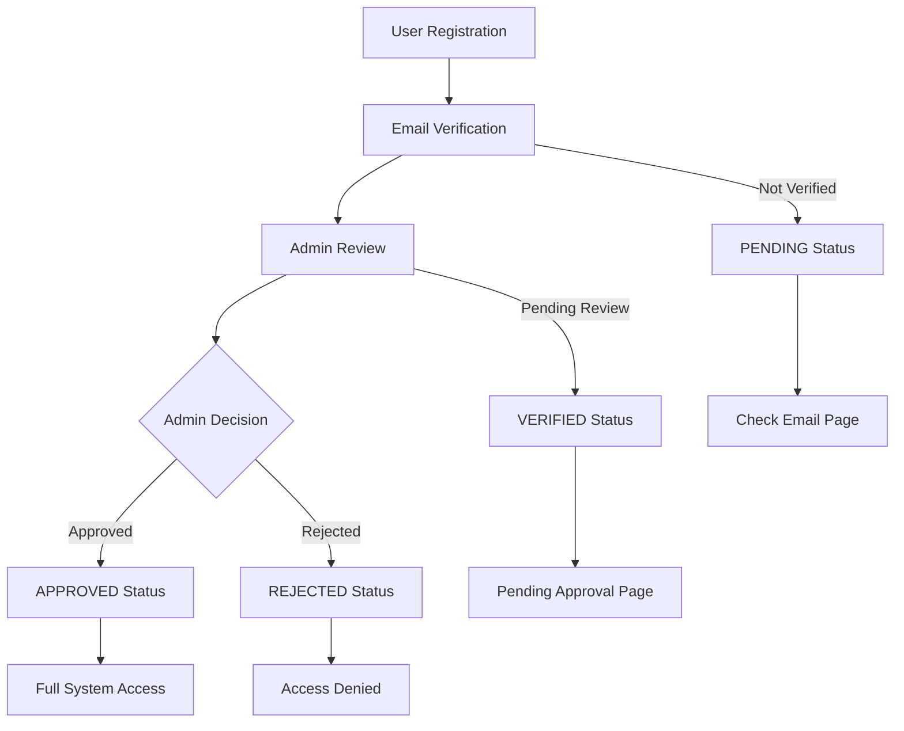

# Authentication & Authorization System

## Overview

The application implements a sophisticated multi-tier authentication and authorization system designed for enterprise-grade security and granular access control.

## Authentication Flow

### Multi-Tier Authentication Process



### User Status Flow

1. **PENDING** - Initial registration, email not verified
2. **VERIFIED** - Email verified, awaiting admin approval
3. **APPROVED** - Full access granted
4. **REJECTED** - Access denied by admin
5. **SUSPENDED** - Temporarily disabled

## Authorization System

### Role-Based Access Control (RBAC)

#### User Roles

```typescript
enum UserRole {
  ADMIN    // Full system access
  MANAGER  // Management functions, limited admin
  STAFF    // Basic operations only
}
```

#### Permission Matrix

| Permission | ADMIN | MANAGER | STAFF |
|------------|-------|---------|-------|
| **Users** |
| users:read | ✅ | ✅ | ❌ |
| users:write | ✅ | ❌ | ❌ |
| users:delete | ✅ | ❌ | ❌ |
| **Inventory** |
| inventory:read | ✅ | ✅ | ✅ |
| inventory:write | ✅ | ✅ | ✅ |
| inventory:delete | ✅ | ❌ | ❌ |
| **Reports** |
| reports:read | ✅ | ✅ | ✅ |
| reports:write | ✅ | ✅ | ❌ |
| **Settings** |
| settings:read | ✅ | ✅ | ❌ |
| settings:write | ✅ | ❌ | ❌ |
| **Audit** |
| audit:read | ✅ | ❌ | ❌ |
| **POS** |
| pos:read | ✅ | ✅ | ✅ |
| pos:write | ✅ | ✅ | ✅ |

## Security Implementation

### 1. Route Protection

#### Middleware Protection (`middleware.ts`)

```typescript
// Three-tier protection:
// 1. Public routes (no auth required)
// 2. Protected routes (auth + status check)
// 3. Admin routes (auth + role check)

const publicRoutes = ['/', '/login', '/register', '/forgot-password']
const protectedRoutes = ['/dashboard', '/inventory', '/pos']
const adminRoutes = ['/admin']
```

#### Route Authorization Logic

```typescript
// 1. Check authentication
if (!token?.user) redirect('/login')

// 2. Check user status
if (userStatus !== 'APPROVED') redirect('/pending-approval')

// 3. Check role permissions
const isAuthorized = authorizeUserForRoute(userRole, pathname)
if (!isAuthorized) redirect('/unauthorized')
```

### 2. API Security

#### Authentication Middleware

```typescript
// All API routes protected except:
const publicApiRoutes = [
  '/api/health',
  '/api/auth/register',
  '/api/auth/login',
  '/api/auth/forgot-password'
]

// Authentication check for protected routes
if (!token?.user) {
  return NextResponse.json({ error: 'Authentication required' }, { status: 401 })
}
```

#### Permission Validation

```typescript
// Server-side permission checking
import { hasPermission } from '@/lib/auth-rbac'

export async function POST(request: NextRequest) {
  const session = await getSession()
  
  if (!hasPermission(session.user.role, 'inventory:write')) {
    return NextResponse.json({ error: 'Insufficient permissions' }, { status: 403 })
  }
  
  // Process request
}
```

### 3. Client-Side Protection

#### Protected Components

```typescript
import { useAuth } from '@/hooks/useAuth'

function AdminOnlyComponent() {
  const { hasPermission } = useAuth()
  
  if (!hasPermission('users:write')) {
    return <UnauthorizedMessage />
  }
  
  return <AdminContent />
}
```

#### Conditional Rendering

```typescript
function NavigationMenu() {
  const { user, hasPermission } = useAuth()
  
  return (
    <nav>
      <Link href="/dashboard">Dashboard</Link>
      <Link href="/inventory">Inventory</Link>
      
      {hasPermission('users:read') && (
        <Link href="/admin">Admin</Link>
      )}
      
      {user.role === 'ADMIN' && (
        <Link href="/admin/settings">Settings</Link>
      )}
    </nav>
  )
}
```

## Session Management

### NextAuth.js Configuration

```typescript
// src/lib/auth-config.ts
export const authConfig = {
  providers: [
    CredentialsProvider({
      async authorize(credentials) {
        // Custom authentication logic
        const user = await validateUser(credentials)
        return user ? transformUserForSession(user) : null
      }
    })
  ],
  
  callbacks: {
    async jwt({ token, user }) {
      // Attach user data to JWT token
      if (user) {
        token.user = {
          id: user.id,
          role: user.role,
          status: user.userStatus,
          isEmailVerified: user.emailVerified
        }
      }
      return token
    },
    
    async session({ session, token }) {
      // Pass token data to session
      session.user = token.user
      return session
    }
  }
}
```

### Session Refresh

Automatic session refresh for long-running sessions:

```typescript
// Session refresh mechanism
export function useSessionRefresh() {
  const { data: session, update } = useSession()
  
  useEffect(() => {
    const refreshSession = async () => {
      if (session?.user?.sessionNeedsRefresh) {
        await update()
      }
    }
    
    const interval = setInterval(refreshSession, 5 * 60 * 1000) // 5 minutes
    return () => clearInterval(interval)
  }, [session, update])
}
```

## Password Security

### Password Policy

```typescript
const passwordPolicy = {
  minLength: 8,
  requireUppercase: true,
  requireLowercase: true,
  requireNumbers: true,
  requireSpecialChars: true,
  preventReuse: 5, // Last 5 passwords
  maxAge: 90 // Days
}
```

### Hashing & Validation

```typescript
import bcrypt from 'bcryptjs'

// Hash password with salt rounds
const hashPassword = async (password: string): Promise<string> => {
  return bcrypt.hash(password, 12)
}

// Validate password against hash
const validatePassword = async (password: string, hash: string): Promise<boolean> => {
  return bcrypt.compare(password, hash)
}
```

### Password Reset Flow

1. User requests reset → generates secure token
2. Token sent via email (expires in 1 hour)
3. User clicks link → validates token
4. New password set → old tokens invalidated

## Email Verification

### Verification Process

```typescript
// Generate verification token
const generateVerificationToken = () => {
  return crypto.randomBytes(32).toString('hex')
}

// Send verification email
await sendVerificationEmail({
  email: user.email,
  token: verificationToken,
  expiresIn: '24h'
})

// Verify token and activate user
const verifyEmail = async (token: string) => {
  const user = await findUserByVerificationToken(token)
  
  if (!user || isTokenExpired(user.emailVerificationExpires)) {
    throw new Error('Invalid or expired token')
  }
  
  await updateUser(user.id, {
    emailVerified: true,
    userStatus: 'VERIFIED',
    emailVerificationToken: null
  })
}
```

## Admin Approval System

### Approval Workflow

```typescript
// Admin actions for user management
export const adminActions = {
  // Approve user
  async approveUser(userId: number, adminId: number) {
    await updateUser(userId, {
      userStatus: 'APPROVED',
      approvedBy: adminId,
      approvedAt: new Date()
    })
    
    // Send approval email
    await sendApprovalEmail(user.email)
    
    // Log audit trail
    await createAuditLog({
      action: 'USER_APPROVED',
      userId: adminId,
      targetId: userId
    })
  },
  
  // Reject user with reason
  async rejectUser(userId: number, adminId: number, reason: string) {
    await updateUser(userId, {
      userStatus: 'REJECTED',
      rejectionReason: reason,
      approvedBy: adminId,
      approvedAt: new Date()
    })
    
    // Send rejection email
    await sendRejectionEmail(user.email, reason)
  }
}
```

## Security Headers

### Comprehensive Security Headers

```typescript
export function generateSecurityHeaders() {
  return {
    'X-Frame-Options': 'DENY',
    'X-Content-Type-Options': 'nosniff',
    'X-XSS-Protection': '1; mode=block',
    'Referrer-Policy': 'strict-origin-when-cross-origin',
    'Permissions-Policy': 'camera=(), microphone=(), geolocation=()',
    'Strict-Transport-Security': 'max-age=31536000; includeSubDomains',
    'Content-Security-Policy': [
      "default-src 'self'",
      "script-src 'self' 'unsafe-eval' 'unsafe-inline'",
      "style-src 'self' 'unsafe-inline'",
      "img-src 'self' data: https:",
      "font-src 'self' data:",
      "connect-src 'self' https:"
    ].join('; ')
  }
}
```

## Rate Limiting

### API Rate Limiting

```typescript
const rateLimitConfig = {
  authentication: '5/minute',      // Login attempts
  registration: '3/hour',          // New registrations
  passwordReset: '3/hour',        // Reset requests
  emailVerification: '5/hour',    // Verification emails
  general: '1000/hour'            // General API calls
}
```

## Audit Logging

### Comprehensive Audit Trail

```typescript
interface AuditLog {
  action: string          // What was done
  userId?: number         // Who did it
  targetId?: number       // What was affected
  ipAddress?: string      // Where from
  userAgent?: string      // What client
  oldValues?: Json        // Previous data
  newValues?: Json        // New data
  createdAt: DateTime     // When
}

// Usage
await logAuditEvent({
  action: 'USER_LOGIN',
  userId: user.id,
  ipAddress: request.ip,
  userAgent: request.headers['user-agent']
})
```

## Error Handling

### Authentication Error Types

```typescript
export class AuthenticationError extends Error {
  constructor(
    message: string,
    public code: 'INVALID_CREDENTIALS' | 'ACCOUNT_LOCKED' | 'EMAIL_NOT_VERIFIED' | 'ACCOUNT_SUSPENDED'
  ) {
    super(message)
  }
}

// Usage in API routes
try {
  await authenticateUser(credentials)
} catch (error) {
  if (error instanceof AuthenticationError) {
    return handleAuthError(error)
  }
  throw error
}
```

---

This authentication system provides enterprise-grade security with multiple layers of protection, comprehensive audit trails, and flexible role-based access control suitable for business applications.