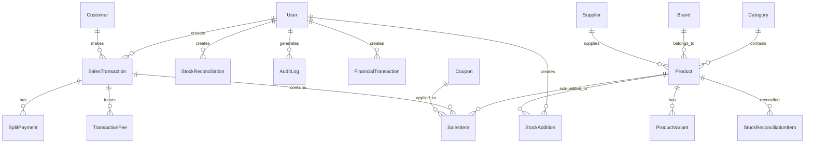

# Database Schema Documentation

## Overview

The application uses PostgreSQL with Prisma ORM, featuring a comprehensive schema designed for a complete inventory POS system with financial tracking, user management, and audit capabilities.

## Database Schema Architecture

### Core Entity Relationships



## Model Documentation

### 1. User Management Models

#### User Model
**Purpose**: Central user management with multi-tier authentication

```sql
-- Key fields and their purposes
users {
    id: Primary key
    firstName, lastName: User identification
    email: Unique identifier (used for login)
    password_hash: Encrypted password storage
    role: UserRole enum (ADMIN, MANAGER, STAFF)
    user_status: UserStatus enum (PENDING, VERIFIED, APPROVED, REJECTED, SUSPENDED)
    
    -- Email verification system
    email_verified: Boolean verification status
    email_verification_token: Secure verification token
    email_verification_expires: Token expiration
    
    -- Password reset system
    reset_token: Password reset token
    reset_token_expires: Reset token expiration
    
    -- Admin approval system
    approved_by: Reference to approving admin
    approved_at: Approval timestamp
    rejection_reason: Reason if rejected
    
    -- Session management
    session_needs_refresh: Force session refresh
    session_refresh_at: Last refresh timestamp
    last_login, last_logout: Activity tracking
    last_activity: Session activity
    
    -- Profile
    phone: Contact number
    avatar_url: Profile picture
    permissions: Custom permission array
    email_notifications: Notification preference
}
```

**Indexes**: Email (unique), role, user_status, email verification, activity timestamps

#### SessionBlacklist Model
**Purpose**: Track invalidated sessions for security

```sql
session_blacklist {
    session_id: Blacklisted session identifier
    user_id: User whose session was blacklisted
    reason: Why session was blacklisted
    blacklisted_at: When blacklisted
    expires_at: When blacklist entry expires
}
```

### 2. Inventory Management Models

#### Product Model
**Purpose**: Central product catalog with comprehensive attributes

```sql
products {
    id: Primary key
    name: Product display name
    description: Detailed product description
    sku: Stock Keeping Unit (unique identifier)
    barcode: Barcode for scanning
    
    -- Pricing
    cost: Purchase/wholesale cost
    price: Retail selling price
    
    -- Inventory tracking
    stock: Current stock quantity
    min_stock: Reorder level threshold
    max_stock: Maximum stock level
    unit: Unit of measurement (piece, kg, liter)
    
    -- Physical attributes
    weight: Product weight
    dimensions: Physical dimensions
    color, size, material: Product variants
    
    -- Product organization
    category_id: Link to category
    brand_id: Link to brand
    supplier_id: Default supplier
    
    -- Product features
    has_variants: Whether product has variants
    is_archived: Soft delete flag
    is_service: Service vs physical product
    status: ProductStatus enum (ACTIVE, INACTIVE, OUT_OF_STOCK, DISCONTINUED)
    
    -- Metadata
    tags: Searchable tags array
    images: Product images (JSON)
    wordpress_id: External system sync
    sync_stats: Analytics sync flag
}
```

**Key Relationships**:
- `category_id` → Categories
- `brand_id` → Brands  
- `supplier_id` → Suppliers

**Indexes**: SKU (unique), stock levels, status, supplier, service type

#### ProductVariant Model
**Purpose**: Handle product variations (size, color, etc.)

```sql
product_variants {
    id: Primary key
    product_id: Parent product reference
    name: Variant display name
    sku: Unique variant SKU
    price, cost: Variant-specific pricing
    
    -- Variant attributes
    color, size, material: Variation attributes
    dimensions: Variant dimensions (JSON)
    weight: Variant weight
    images: Variant-specific images (JSON)
    
    -- Inventory
    current_stock: Variant stock level
    min_stock_level, max_stock_level: Variant thresholds
    
    -- Status
    is_active: Whether variant is available
}
```

#### Category Model  
**Purpose**: Hierarchical product categorization

```sql
categories {
    id: Primary key
    name: Category name
    description: Category description
    parent_id: Self-referencing for hierarchy
    image: Category image
    is_active: Category availability
    wordpress_id: External sync
}
```

**Features**: 
- Self-referencing hierarchy (parent-child relationships)
- Unique constraint on name per parent level

#### Brand Model
**Purpose**: Product brand management

```sql
brands {
    id: Primary key
    name: Brand name (unique)
    description: Brand description
    website: Brand website URL
    image: Brand logo
    is_active: Brand availability
    wordpress_id: External sync
}
```

#### Supplier Model
**Purpose**: Vendor/supplier management

```sql
suppliers {
    id: Primary key
    name: Supplier company name
    contact_person: Primary contact
    email, phone: Contact information
    address, city, state: Physical address
    website: Supplier website
    notes: Additional supplier notes
}
```

### 3. Sales & Transaction Models

#### SalesTransaction Model
**Purpose**: Core transaction processing

```sql
sales_transactions {
    id: Primary key
    transaction_number: Unique transaction identifier
    
    -- Financial details
    subtotal: Pre-tax total
    tax_amount: Applied taxes
    discount_amount: Applied discounts
    total_amount: Final transaction total
    
    -- Payment processing
    payment_method: How customer paid
    payment_status: Transaction status (pending, completed)
    
    -- Transaction metadata
    transaction_type: Type of transaction (sale, refund)
    notes: Transaction notes
    created_at: Transaction timestamp
    
    -- Relationships
    user_id: Staff member who processed
    customer_id: Customer (optional)
}
```

**Key Features**:
- Unique transaction numbering system
- Support for multiple payment methods
- Customer linkage (optional for walk-ins)
- Comprehensive financial tracking

#### SalesItem Model
**Purpose**: Individual items within a transaction

```sql
sales_items {
    id: Primary key
    transaction_id: Parent transaction
    product_id: Product being sold
    variant_id: Product variant (if applicable)
    
    -- Item details
    quantity: Number of items
    unit_price: Price per unit at time of sale
    total_price: Line total (quantity × unit_price)
    discount_amount: Item-level discount
    
    -- Coupon application
    coupon_id: Applied coupon (if any)
}
```

**Key Features**:
- Historical pricing (stores price at time of sale)
- Variant support
- Item-level discounts
- Coupon application tracking

#### SplitPayment Model
**Purpose**: Handle transactions paid with multiple methods

```sql
split_payments {
    id: Primary key
    transaction_id: Parent transaction
    payment_method: Payment method type
    amount: Amount paid via this method
}
```

#### Customer Model
**Purpose**: Customer relationship management

```sql
customers {
    id: Primary key
    name: Customer name
    email: Customer email (unique)
    phone: Contact number
    
    -- Address information
    billing_address, shipping_address: Customer addresses
    city, state, postal_code, country: Location details
    
    -- Customer classification
    customer_type: Type (individual, business)
    notes: Customer notes
    is_active: Customer status
}
```

### 4. Stock Management Models

#### StockAddition Model
**Purpose**: Track inventory additions/purchases

```sql
stock_additions {
    id: Primary key
    product_id: Product being restocked
    supplier_id: Supplier of the stock
    
    -- Purchase details
    quantity: Units added
    cost_per_unit: Unit purchase cost
    total_cost: Total purchase amount
    purchase_date: When purchased
    reference_no: Purchase order/invoice number
    
    -- Metadata
    notes: Additional notes
    created_by: Staff member who added
}
```

#### StockReconciliation Model
**Purpose**: Physical inventory reconciliation process

```sql
stock_reconciliations {
    id: Primary key
    title: Reconciliation session name
    description: Session description
    notes: Additional notes
    
    -- Workflow status
    status: stock_reconciliation_status enum (DRAFT, PENDING, APPROVED, REJECTED)
    
    -- Process tracking
    created_by: Who initiated
    approved_by: Who approved
    submitted_at: When submitted for approval
    approved_at: When approved
}
```

#### StockReconciliationItem Model
**Purpose**: Individual product reconciliation details

```sql
stock_reconciliation_items {
    id: Primary key
    reconciliation_id: Parent reconciliation session
    product_id: Product being reconciled
    
    -- Count comparison
    system_count: System recorded quantity
    physical_count: Actual counted quantity
    discrepancy: Difference (physical - system)
    discrepancy_reason: Why there's a difference
    
    -- Impact assessment
    estimated_impact: Financial impact of discrepancy
    notes: Item-specific notes
}
```

#### StockAdjustment Model
**Purpose**: Manual stock adjustments (damage, theft, etc.)

```sql
stock_adjustments {
    id: Primary key
    product_id: Product being adjusted
    variant_id: Variant (if applicable)
    
    -- Adjustment details
    old_quantity: Previous stock level
    new_quantity: New stock level
    quantity: Change amount
    adjustment_type: Type of adjustment
    reason: Why adjustment was made
    
    -- Approval workflow
    status: Approval status (PENDING, APPROVED, REJECTED)
    approved_by: Who approved
    approved_at: When approved
    rejection_reason: If rejected, why
    
    -- Tracking
    user_id: Who requested
    reference_number: Reference for adjustment
}
```

### 5. Financial Models

#### FinancialTransaction Model
**Purpose**: Comprehensive financial transaction tracking

```sql
financial_transactions {
    id: Primary key
    transaction_number: Unique financial transaction ID
    type: FinancialType enum (EXPENSE, INCOME)
    amount: Transaction amount
    description: Transaction description
    transaction_date: When transaction occurred
    
    -- Approval workflow
    status: FinancialStatus enum (PENDING, COMPLETED, CANCELLED, APPROVED, REJECTED)
    approved_by: Who approved
    approved_at: When approved
    created_by: Who created
    
    -- Payment details
    payment_method: How payment was made
}
```

#### ExpenseDetail Model
**Purpose**: Detailed expense information

```sql
expense_details {
    transaction_id: Link to financial transaction
    vendor_name: Who was paid
    expense_type: ExpenseType enum (UTILITIES, RENT, SALARIES, etc.)
}
```

#### IncomeDetail Model
**Purpose**: Detailed income information  

```sql
income_details {
    transaction_id: Link to financial transaction
    payer_name: Who paid
    income_source: IncomeSource enum (SALES, SERVICES, INVESTMENTS, etc.)
}
```

#### FinancialReport Model
**Purpose**: Generated financial reports

```sql
financial_reports {
    id: Primary key
    report_type: Type of report generated
    report_name: Display name
    period_start, period_end: Report period
    report_data: Generated report data (JSON)
    file_url: Report file location
    generated_by: Who generated the report
}
```

### 6. Promotional & Loyalty Models

#### Coupon Model
**Purpose**: Discount coupon management

```sql
coupons {
    id: Primary key
    code: Unique coupon code
    name: Display name
    description: Coupon description
    
    -- Discount details
    type: CouponType enum (PERCENTAGE, FIXED)
    value: Discount value
    minimum_amount: Minimum purchase for coupon
    
    -- Usage limits
    max_uses: Maximum total uses
    current_uses: Current usage count
    
    -- Validity period
    valid_from, valid_until: Coupon validity dates
    is_active: Whether coupon is active
    
    -- Metadata
    created_by: Who created the coupon
}
```

#### TransactionFee Model
**Purpose**: Additional fees on transactions

```sql
transaction_fees {
    id: Primary key
    transaction_id: Parent transaction
    fee_type: Type of fee (processing, service, etc.)
    description: Fee description
    amount: Fee amount
}
```

### 7. System & Audit Models

#### AuditLog Model
**Purpose**: Comprehensive audit trail

```sql
audit_logs {
    id: Primary key
    table_name: Which table was affected
    record_id: Which record was affected
    action: What action was performed
    
    -- Change tracking
    old_values: Previous data state (JSON)
    new_values: New data state (JSON)
    
    -- User context
    user_id: Who performed the action
    ip_address: Where the action came from
    user_agent: What client was used
    
    created_at: When the action occurred
}
```

#### RateLimit Model
**Purpose**: API rate limiting tracking

```sql
rate_limits {
    id: Primary key
    key: Rate limit identifier
    count: Current request count
    created_at: When counting started
}
```

#### AIContent Model  
**Purpose**: AI-generated content management

```sql
ai_content {
    id: Primary key
    product_id: Product the content is for
    content_type: Type of content (description, title, etc.)
    original_content: Original content
    generated_content: AI-generated content
    
    -- AI metadata
    model_used: Which AI model generated content
    prompt_used: Prompt that generated content
    confidence_score: AI confidence in generated content
    
    -- Approval workflow
    is_approved: Whether content is approved for use
    approved_by: Who approved the content
    approved_at: When approved
}
```

## Database Constraints & Indexes

### Primary Constraints

1. **Unique Constraints**:
   - `users.email` - One account per email
   - `products.sku` - Unique product identification
   - `product_variants.sku` - Unique variant identification
   - `brands.name` - One brand per name
   - `sales_transactions.transaction_number` - Unique transaction IDs
   - `coupons.code` - Unique coupon codes
   - `customers.email` - One customer per email

2. **Foreign Key Constraints**:
   - All relationships maintain referential integrity
   - Cascade deletes where appropriate (e.g., variants when product deleted)
   - Restrict deletes where data integrity is critical

### Performance Indexes

#### High-Traffic Queries
```sql
-- User authentication
CREATE INDEX idx_users_email ON users(email);
CREATE INDEX idx_users_role ON users(role);
CREATE INDEX idx_users_user_status ON users(user_status);

-- Product lookups
CREATE INDEX idx_products_sku ON products(sku);
CREATE INDEX idx_products_status ON products(status);
CREATE INDEX idx_products_stock ON products(stock);

-- Transaction processing
CREATE INDEX idx_sales_transactions_transaction_number ON sales_transactions(transaction_number);
CREATE INDEX idx_sales_transactions_created_at ON sales_transactions(created_at);
CREATE INDEX idx_sales_transactions_payment_status ON sales_transactions(payment_status);

-- Financial reporting
CREATE INDEX idx_financial_transactions_type_date ON financial_transactions(type, transaction_date);
CREATE INDEX idx_financial_transactions_status_date ON financial_transactions(status, transaction_date);

-- Audit queries
CREATE INDEX idx_audit_logs_table_name ON audit_logs(table_name);
CREATE INDEX idx_audit_logs_created_at ON audit_logs(created_at);
CREATE INDEX idx_audit_logs_user_id ON audit_logs(user_id);
```

#### Composite Indexes for Complex Queries
```sql
-- Multi-column indexes for common query patterns
CREATE INDEX idx_sales_transactions_payment_status_created_at ON sales_transactions(payment_status, created_at);
CREATE INDEX idx_stock_additions_purchase_date_total_cost ON stock_additions(purchase_date, total_cost);
```

## Data Validation & Business Rules

### Database-Level Validation

1. **Check Constraints**:
   ```sql
   -- Ensure positive quantities and prices
   ALTER TABLE products ADD CONSTRAINT positive_stock CHECK (stock >= 0);
   ALTER TABLE products ADD CONSTRAINT positive_price CHECK (price >= 0);
   ALTER TABLE sales_items ADD CONSTRAINT positive_quantity CHECK (quantity > 0);
   ```

2. **Enum Constraints**:
   - User roles limited to ADMIN, MANAGER, STAFF
   - User status controlled workflow
   - Transaction statuses prevent invalid state transitions

### Application-Level Validation

1. **Zod Schemas**: All form inputs validated
2. **Business Logic**: Complex rules in application code
3. **Audit Logging**: All changes tracked automatically

## Data Migration Strategy

### Version Control
- Prisma migrations track schema changes
- Rolling deployments supported
- Rollback capabilities for schema changes

### Data Integrity
- Foreign key constraints maintained during migrations
- Data validation during major schema changes
- Backup/restore procedures for critical updates

---

This database schema provides a robust foundation for a comprehensive inventory POS system with full audit capabilities, financial tracking, and user management suitable for business operations.