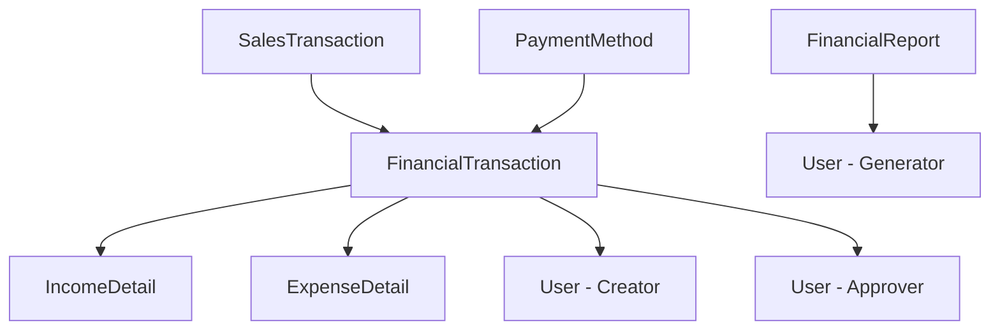

# Finance Module Documentation

## Overview

The finance module provides comprehensive financial management capabilities including income and expense tracking, financial reporting, analytics, and approval workflows for business financial operations.

## Financial Architecture

### Core Financial Models



### Transaction Types

The system supports two main financial transaction types:

1. **INCOME** - Revenue from sales, services, investments
2. **EXPENSE** - Business costs, purchases, operational expenses

### Transaction Status Flow

```
PENDING → APPROVED/REJECTED
    ↓
COMPLETED (if approved)
CANCELLED (if rejected)
```

## Financial Models

### FinancialTransaction Model

```typescript
interface FinancialTransaction {
  id: number;
  transactionNumber: string;    // Unique identifier
  type: FinancialType;         // INCOME or EXPENSE
  amount: number;              // Transaction amount
  description: string;         // Transaction description
  transactionDate: Date;       // When transaction occurred
  
  // Status management
  status: FinancialStatus;     // PENDING, COMPLETED, CANCELLED, APPROVED, REJECTED
  
  // Approval workflow
  createdBy: number;           // User who created
  approvedBy?: number;         // User who approved/rejected
  approvedAt?: DateTime;       // When approved/rejected
  
  // Payment information
  paymentMethod?: PaymentMethod;
  
  // Detailed information
  expenseDetails?: ExpenseDetail;
  incomeDetails?: IncomeDetail;
  
  // Timestamps
  createdAt: DateTime;
  updatedAt: DateTime;
}
```

### ExpenseDetail Model

```typescript
interface ExpenseDetail {
  id: number;
  transactionId: number;       // Link to financial transaction
  vendorName?: string;         // Who was paid
  expenseType: ExpenseType;    // Category of expense
  createdAt: DateTime;
  
  // Relationship
  transaction: FinancialTransaction;
}

enum ExpenseType {
  INVENTORY_PURCHASES = 'INVENTORY_PURCHASES',
  UTILITIES = 'UTILITIES',
  RENT = 'RENT',
  SALARIES = 'SALARIES',
  MARKETING = 'MARKETING',
  OFFICE_SUPPLIES = 'OFFICE_SUPPLIES',
  TRAVEL = 'TRAVEL',
  INSURANCE = 'INSURANCE',
  MAINTENANCE = 'MAINTENANCE',
  OTHER = 'OTHER'
}
```

### IncomeDetail Model

```typescript
interface IncomeDetail {
  id: number;
  transactionId: number;       // Link to financial transaction
  payerName?: string;          // Who paid
  incomeSource: IncomeSource;  // Source of income
  createdAt: DateTime;
  
  // Relationship
  transaction: FinancialTransaction;
}

enum IncomeSource {
  SALES = 'SALES',
  SERVICES = 'SERVICES',
  INVESTMENTS = 'INVESTMENTS',
  ROYALTIES = 'ROYALTIES',
  COMMISSIONS = 'COMMISSIONS',
  OTHER = 'OTHER'
}
```

## Financial Transaction Management

### Creating Financial Transactions

#### Add Expense Form (`AddExpenseForm.tsx`)

```typescript
export default function AddExpenseForm() {
  const form = useForm({
    resolver: zodResolver(expenseSchema),
    defaultValues: defaultExpenseValues
  });

  const { onSubmit, isSubmitting } = useExpenseSubmit(form);

  return (
    <div className="mx-auto max-w-2xl space-y-6 p-6">
      <PageHeader
        title="Add New Expense"
        description="Record a new business expense transaction"
      />

      <Form {...form}>
        <form onSubmit={form.handleSubmit(onSubmit)} className="space-y-6">
          <Card>
            <CardHeader>
              <CardTitle>Basic Information</CardTitle>
            </CardHeader>
            <CardContent className="space-y-4">
              <BasicInfoSection />
              <ExpenseDetailsSection />
              <AdditionalInfoSection />
            </CardContent>
          </Card>

          <FormActions isSubmitting={isSubmitting} />
        </form>
      </Form>
    </div>
  );
}
```

#### Expense Form Sections

**BasicInfoSection:**
```typescript
export function BasicInfoSection() {
  const form = useFormContext();

  return (
    <div className="grid gap-4 md:grid-cols-2">
      <FormField
        control={form.control}
        name="amount"
        render={({ field }) => (
          <FormItem>
            <FormLabel>Amount *</FormLabel>
            <FormControl>
              <div className="relative">
                <span className="absolute left-3 top-1/2 -translate-y-1/2 text-muted-foreground">
                  ₦
                </span>
                <Input
                  type="number"
                  step="0.01"
                  min="0"
                  placeholder="0.00"
                  className="pl-8"
                  {...field}
                />
              </div>
            </FormControl>
            <FormMessage />
          </FormItem>
        )}
      />

      <FormField
        control={form.control}
        name="transactionDate"
        render={({ field }) => (
          <FormItem>
            <FormLabel>Transaction Date *</FormLabel>
            <FormControl>
              <Input
                type="date"
                {...field}
                value={field.value ? format(field.value, 'yyyy-MM-dd') : ''}
                onChange={(e) => {
                  const date = e.target.value ? parseISO(e.target.value) : null;
                  field.onChange(date);
                }}
              />
            </FormControl>
            <FormMessage />
          </FormItem>
        )}
      />

      <div className="md:col-span-2">
        <FormField
          control={form.control}
          name="description"
          render={({ field }) => (
            <FormItem>
              <FormLabel>Description *</FormLabel>
              <FormControl>
                <Textarea
                  placeholder="Describe the expense..."
                  className="min-h-[100px]"
                  {...field}
                />
              </FormControl>
              <FormMessage />
            </FormItem>
          )}
        />
      </div>
    </div>
  );
}
```

**ExpenseDetailsSection:**
```typescript
export function ExpenseDetailsSection() {
  const form = useFormContext();

  return (
    <div className="space-y-4">
      <h3 className="text-lg font-medium">Expense Details</h3>
      
      <div className="grid gap-4 md:grid-cols-2">
        <FormField
          control={form.control}
          name="expenseType"
          render={({ field }) => (
            <FormItem>
              <FormLabel>Expense Category *</FormLabel>
              <Select value={field.value} onValueChange={field.onChange}>
                <FormControl>
                  <SelectTrigger>
                    <SelectValue placeholder="Select expense type" />
                  </SelectTrigger>
                </FormControl>
                <SelectContent>
                  <SelectItem value="INVENTORY_PURCHASES">Inventory Purchases</SelectItem>
                  <SelectItem value="UTILITIES">Utilities</SelectItem>
                  <SelectItem value="RENT">Rent</SelectItem>
                  <SelectItem value="SALARIES">Salaries</SelectItem>
                  <SelectItem value="MARKETING">Marketing</SelectItem>
                  <SelectItem value="OFFICE_SUPPLIES">Office Supplies</SelectItem>
                  <SelectItem value="TRAVEL">Travel</SelectItem>
                  <SelectItem value="INSURANCE">Insurance</SelectItem>
                  <SelectItem value="MAINTENANCE">Maintenance</SelectItem>
                  <SelectItem value="OTHER">Other</SelectItem>
                </SelectContent>
              </Select>
              <FormMessage />
            </FormItem>
          )}
        />

        <FormField
          control={form.control}
          name="vendorName"
          render={({ field }) => (
            <FormItem>
              <FormLabel>Vendor/Payee</FormLabel>
              <FormControl>
                <Input placeholder="Enter vendor name" {...field} />
              </FormControl>
              <FormMessage />
            </FormItem>
          )}
        />

        <FormField
          control={form.control}
          name="paymentMethod"
          render={({ field }) => (
            <FormItem>
              <FormLabel>Payment Method</FormLabel>
              <Select value={field.value} onValueChange={field.onChange}>
                <FormControl>
                  <SelectTrigger>
                    <SelectValue placeholder="Select payment method" />
                  </SelectTrigger>
                </FormControl>
                <SelectContent>
                  <SelectItem value="CASH">Cash</SelectItem>
                  <SelectItem value="BANK_TRANSFER">Bank Transfer</SelectItem>
                  <SelectItem value="CREDIT_CARD">Credit Card</SelectItem>
                  <SelectItem value="POS_MACHINE">POS Machine</SelectItem>
                  <SelectItem value="MOBILE_MONEY">Mobile Money</SelectItem>
                </SelectContent>
              </Select>
              <FormMessage />
            </FormItem>
          )}
        />
      </div>
    </div>
  );
}
```

### Transaction Processing API

#### Create Financial Transaction Endpoint

```typescript
export const POST = withAuth(async (request: AuthenticatedRequest) => {
  try {
    const body = await request.json();
    const validatedData = financialTransactionSchema.parse(body);

    // Generate unique transaction number
    const transactionNumber = `${validatedData.type === 'INCOME' ? 'IN' : 'EX'}-${Date.now()}-${Math.random().toString(36).substr(2, 6).toUpperCase()}`;

    const result = await prisma.$transaction(async (tx) => {
      // Create main financial transaction
      const transaction = await tx.financialTransaction.create({
        data: {
          transactionNumber,
          type: validatedData.type,
          amount: validatedData.amount,
          description: validatedData.description,
          transactionDate: validatedData.transactionDate,
          status: 'PENDING', // Requires approval for large amounts
          paymentMethod: validatedData.paymentMethod,
          createdBy: parseInt(request.user.id)
        }
      });

      // Create detailed information based on transaction type
      if (validatedData.type === 'EXPENSE') {
        await tx.expenseDetail.create({
          data: {
            transactionId: transaction.id,
            vendorName: validatedData.vendorName,
            expenseType: validatedData.expenseType
          }
        });
      } else if (validatedData.type === 'INCOME') {
        await tx.incomeDetail.create({
          data: {
            transactionId: transaction.id,
            payerName: validatedData.payerName,
            incomeSource: validatedData.incomeSource
          }
        });
      }

      // Log audit trail
      await tx.auditLog.create({
        data: {
          action: `${validatedData.type}_TRANSACTION_CREATED`,
          tableName: 'financial_transactions',
          recordId: transaction.id,
          userId: parseInt(request.user.id),
          newValues: {
            transactionNumber: transaction.transactionNumber,
            type: transaction.type,
            amount: Number(transaction.amount),
            description: transaction.description
          }
        }
      });

      return transaction;
    });

    // Auto-approve small transactions
    if (validatedData.amount < 10000) { // ₦10,000 threshold
      await approveTransaction(result.id, parseInt(request.user.id));
    }

    return NextResponse.json({
      success: true,
      message: 'Financial transaction created successfully',
      transaction: result
    }, { status: 201 });

  } catch (error) {
    return handleApiError(error);
  }
});
```

### Approval Workflow

#### Transaction Approval System

```typescript
export async function approveTransaction(
  transactionId: number,
  approverId: number
) {
  return prisma.$transaction(async (tx) => {
    const transaction = await tx.financialTransaction.findUnique({
      where: { id: transactionId }
    });

    if (!transaction) {
      throw new Error('Transaction not found');
    }

    if (transaction.status !== 'PENDING') {
      throw new Error('Transaction is not pending approval');
    }

    // Update transaction status
    const updatedTransaction = await tx.financialTransaction.update({
      where: { id: transactionId },
      data: {
        status: 'APPROVED',
        approvedBy: approverId,
        approvedAt: new Date()
      }
    });

    // Log approval
    await tx.auditLog.create({
      data: {
        action: `${transaction.type}_TRANSACTION_APPROVED`,
        tableName: 'financial_transactions',
        recordId: transactionId,
        userId: approverId,
        oldValues: { status: 'PENDING' },
        newValues: { status: 'APPROVED' }
      }
    });

    return updatedTransaction;
  });
}

export async function rejectTransaction(
  transactionId: number,
  approverId: number,
  rejectionReason: string
) {
  return prisma.$transaction(async (tx) => {
    const updatedTransaction = await tx.financialTransaction.update({
      where: { id: transactionId },
      data: {
        status: 'REJECTED',
        approvedBy: approverId,
        approvedAt: new Date()
      }
    });

    // Log rejection
    await tx.auditLog.create({
      data: {
        action: `${updatedTransaction.type}_TRANSACTION_REJECTED`,
        tableName: 'financial_transactions',
        recordId: transactionId,
        userId: approverId,
        oldValues: { status: 'PENDING' },
        newValues: { 
          status: 'REJECTED',
          rejectionReason
        }
      }
    });

    return updatedTransaction;
  });
}
```

## Financial Reporting

### Financial Reports System

#### Report Generation

```typescript
export async function generateFinancialReport(
  reportType: 'income_statement' | 'cash_flow' | 'expenses_summary',
  startDate: Date,
  endDate: Date,
  userId: number
) {
  const reportData = await generateReportData(reportType, startDate, endDate);

  // Save report for future reference
  const report = await prisma.financialReport.create({
    data: {
      reportType,
      reportName: `${reportType.replace('_', ' ').replace(/\b\w/g, l => l.toUpperCase())} - ${format(startDate, 'MMM yyyy')}`,
      periodStart: startDate,
      periodEnd: endDate,
      reportData,
      generatedBy: userId
    }
  });

  return report;
}

async function generateReportData(
  reportType: string,
  startDate: Date,
  endDate: Date
) {
  switch (reportType) {
    case 'income_statement':
      return await generateIncomeStatement(startDate, endDate);
    case 'cash_flow':
      return await generateCashFlowReport(startDate, endDate);
    case 'expenses_summary':
      return await generateExpensesSummary(startDate, endDate);
    default:
      throw new Error('Invalid report type');
  }
}
```

#### Income Statement Report

```typescript
export async function generateIncomeStatement(
  startDate: Date,
  endDate: Date
) {
  const [incomeData, expenseData] = await Promise.all([
    // Get all income transactions
    prisma.financialTransaction.findMany({
      where: {
        type: 'INCOME',
        transactionDate: { gte: startDate, lte: endDate },
        status: { in: ['APPROVED', 'COMPLETED'] }
      },
      include: {
        incomeDetails: true
      }
    }),

    // Get all expense transactions
    prisma.financialTransaction.findMany({
      where: {
        type: 'EXPENSE',
        transactionDate: { gte: startDate, lte: endDate },
        status: { in: ['APPROVED', 'COMPLETED'] }
      },
      include: {
        expenseDetails: true
      }
    })
  ]);

  // Calculate income by source
  const incomeBySource = incomeData.reduce((acc, transaction) => {
    const source = transaction.incomeDetails?.incomeSource || 'OTHER';
    if (!acc[source]) {
      acc[source] = 0;
    }
    acc[source] += Number(transaction.amount);
    return acc;
  }, {} as Record<string, number>);

  // Calculate expenses by type
  const expensesByType = expenseData.reduce((acc, transaction) => {
    const type = transaction.expenseDetails?.expenseType || 'OTHER';
    if (!acc[type]) {
      acc[type] = 0;
    }
    acc[type] += Number(transaction.amount);
    return acc;
  }, {} as Record<string, number>);

  const totalIncome = Object.values(incomeBySource).reduce((sum, amount) => sum + amount, 0);
  const totalExpenses = Object.values(expensesByType).reduce((sum, amount) => sum + amount, 0);
  const netIncome = totalIncome - totalExpenses;

  return {
    period: {
      startDate: startDate.toISOString(),
      endDate: endDate.toISOString()
    },
    income: {
      bySource: incomeBySource,
      total: totalIncome
    },
    expenses: {
      byType: expensesByType,
      total: totalExpenses
    },
    netIncome,
    margin: totalIncome > 0 ? (netIncome / totalIncome) * 100 : 0
  };
}
```

#### Cash Flow Report

```typescript
export async function generateCashFlowReport(
  startDate: Date,
  endDate: Date
) {
  const transactions = await prisma.financialTransaction.findMany({
    where: {
      transactionDate: { gte: startDate, lte: endDate },
      status: { in: ['APPROVED', 'COMPLETED'] }
    },
    include: {
      incomeDetails: true,
      expenseDetails: true
    },
    orderBy: { transactionDate: 'asc' }
  });

  let runningBalance = 0;
  const dailyCashFlow = new Map<string, {
    date: string;
    income: number;
    expenses: number;
    netFlow: number;
    balance: number;
    transactions: number;
  }>();

  // Process transactions chronologically
  transactions.forEach(transaction => {
    const dateKey = format(transaction.transactionDate, 'yyyy-MM-dd');
    
    if (!dailyCashFlow.has(dateKey)) {
      dailyCashFlow.set(dateKey, {
        date: dateKey,
        income: 0,
        expenses: 0,
        netFlow: 0,
        balance: 0,
        transactions: 0
      });
    }

    const dayData = dailyCashFlow.get(dateKey)!;
    const amount = Number(transaction.amount);

    if (transaction.type === 'INCOME') {
      dayData.income += amount;
      runningBalance += amount;
    } else {
      dayData.expenses += amount;
      runningBalance -= amount;
    }

    dayData.netFlow = dayData.income - dayData.expenses;
    dayData.balance = runningBalance;
    dayData.transactions += 1;
  });

  const cashFlowData = Array.from(dailyCashFlow.values()).sort(
    (a, b) => new Date(a.date).getTime() - new Date(b.date).getTime()
  );

  const summary = {
    openingBalance: 0, // This would come from previous period
    closingBalance: runningBalance,
    totalInflow: cashFlowData.reduce((sum, day) => sum + day.income, 0),
    totalOutflow: cashFlowData.reduce((sum, day) => sum + day.expenses, 0),
    netCashFlow: runningBalance,
    averageDailyFlow: cashFlowData.length > 0 
      ? runningBalance / cashFlowData.length 
      : 0
  };

  return {
    period: {
      startDate: startDate.toISOString(),
      endDate: endDate.toISOString()
    },
    summary,
    dailyFlow: cashFlowData
  };
}
```

### Financial Analytics

#### Advanced Analytics Dashboard

```typescript
export async function getFinancialAnalytics(
  startDate: Date,
  endDate: Date
) {
  const [
    periodData,
    previousPeriodData,
    monthlyTrends,
    categoryBreakdown,
    paymentMethodStats
  ] = await Promise.all([
    // Current period data
    getFinancialSummary(startDate, endDate),
    
    // Previous period for comparison
    getFinancialSummary(
      subDays(startDate, differenceInDays(endDate, startDate) + 1),
      subDays(startDate, 1)
    ),
    
    // Monthly trends
    getMonthlyFinancialTrends(startDate, endDate),
    
    // Category breakdown
    getCategoryBreakdown(startDate, endDate),
    
    // Payment method statistics
    getPaymentMethodStats(startDate, endDate)
  ]);

  // Calculate growth metrics
  const metrics = {
    revenue: {
      current: periodData.totalIncome,
      previous: previousPeriodData.totalIncome,
      growth: previousPeriodData.totalIncome > 0 
        ? ((periodData.totalIncome - previousPeriodData.totalIncome) / previousPeriodData.totalIncome) * 100 
        : 0
    },
    expenses: {
      current: periodData.totalExpenses,
      previous: previousPeriodData.totalExpenses,
      growth: previousPeriodData.totalExpenses > 0
        ? ((periodData.totalExpenses - previousPeriodData.totalExpenses) / previousPeriodData.totalExpenses) * 100
        : 0
    },
    profit: {
      current: periodData.netIncome,
      previous: previousPeriodData.netIncome,
      growth: previousPeriodData.netIncome !== 0
        ? ((periodData.netIncome - previousPeriodData.netIncome) / Math.abs(previousPeriodData.netIncome)) * 100
        : 0
    }
  };

  return {
    summary: periodData,
    comparison: metrics,
    trends: monthlyTrends,
    categories: categoryBreakdown,
    paymentMethods: paymentMethodStats
  };
}

async function getFinancialSummary(startDate: Date, endDate: Date) {
  const summary = await prisma.financialTransaction.aggregate({
    where: {
      transactionDate: { gte: startDate, lte: endDate },
      status: { in: ['APPROVED', 'COMPLETED'] }
    },
    _sum: {
      amount: true
    },
    _count: {
      id: true
    }
  });

  const [incomeSum, expenseSum] = await Promise.all([
    prisma.financialTransaction.aggregate({
      where: {
        type: 'INCOME',
        transactionDate: { gte: startDate, lte: endDate },
        status: { in: ['APPROVED', 'COMPLETED'] }
      },
      _sum: { amount: true }
    }),
    prisma.financialTransaction.aggregate({
      where: {
        type: 'EXPENSE',
        transactionDate: { gte: startDate, lte: endDate },
        status: { in: ['APPROVED', 'COMPLETED'] }
      },
      _sum: { amount: true }
    })
  ]);

  const totalIncome = Number(incomeSum._sum.amount) || 0;
  const totalExpenses = Number(expenseSum._sum.amount) || 0;

  return {
    totalIncome,
    totalExpenses,
    netIncome: totalIncome - totalExpenses,
    transactionCount: summary._count.id,
    profitMargin: totalIncome > 0 ? ((totalIncome - totalExpenses) / totalIncome) * 100 : 0
  };
}
```

### Financial Widgets

#### Real-time Financial Metrics

```typescript
export function FinancialWidgets() {
  const [metrics, setMetrics] = useState<FinancialMetrics | null>(null);
  const [loading, setLoading] = useState(true);

  useEffect(() => {
    loadFinancialMetrics();
  }, []);

  const loadFinancialMetrics = async () => {
    try {
      const endDate = new Date();
      const startDate = startOfMonth(endDate);
      
      const response = await fetch(
        `/api/finance/analytics?startDate=${startDate.toISOString()}&endDate=${endDate.toISOString()}`
      );
      const data = await response.json();
      
      if (data.success) {
        setMetrics(data.analytics);
      }
    } catch (error) {
      console.error('Failed to load financial metrics:', error);
    } finally {
      setLoading(false);
    }
  };

  if (loading) {
    return <MetricsLoading />;
  }

  if (!metrics) {
    return <MetricsError onRetry={loadFinancialMetrics} />;
  }

  return (
    <div className="grid gap-6 md:grid-cols-2 lg:grid-cols-4">
      <MetricCard
        title="Total Revenue"
        value={formatCurrency(metrics.summary.totalIncome)}
        change={metrics.comparison.revenue.growth}
        icon={TrendingUp}
        trend="up"
      />
      
      <MetricCard
        title="Total Expenses"
        value={formatCurrency(metrics.summary.totalExpenses)}
        change={metrics.comparison.expenses.growth}
        icon={TrendingDown}
        trend="down"
      />
      
      <MetricCard
        title="Net Profit"
        value={formatCurrency(metrics.summary.netIncome)}
        change={metrics.comparison.profit.growth}
        icon={DollarSign}
        trend={metrics.summary.netIncome >= 0 ? "up" : "down"}
      />
      
      <MetricCard
        title="Profit Margin"
        value={`${metrics.summary.profitMargin.toFixed(1)}%`}
        change={0} // Calculate margin change
        icon={Percent}
        trend="neutral"
      />
    </div>
  );
}

function MetricCard({ title, value, change, icon: Icon, trend }: MetricCardProps) {
  return (
    <Card>
      <CardHeader className="flex flex-row items-center justify-between space-y-0 pb-2">
        <CardTitle className="text-sm font-medium">{title}</CardTitle>
        <Icon className="h-4 w-4 text-muted-foreground" />
      </CardHeader>
      <CardContent>
        <div className="text-2xl font-bold">{value}</div>
        {change !== 0 && (
          <p className={`text-xs flex items-center ${
            trend === 'up' ? 'text-green-600' : 
            trend === 'down' ? 'text-red-600' : 
            'text-muted-foreground'
          }`}>
            {trend === 'up' ? (
              <ArrowUpIcon className="mr-1 h-3 w-3" />
            ) : trend === 'down' ? (
              <ArrowDownIcon className="mr-1 h-3 w-3" />
            ) : null}
            {Math.abs(change).toFixed(1)}% from last period
          </p>
        )}
      </CardContent>
    </Card>
  );
}
```

### Budget Management

#### Budget Tracking System

```typescript
interface Budget {
  id: number;
  name: string;
  category: ExpenseType;
  amount: number;        // Budget limit
  period: 'MONTHLY' | 'QUARTERLY' | 'YEARLY';
  startDate: Date;
  endDate: Date;
  spent: number;         // Calculated current spending
  remaining: number;     // Budget - spent
  userId: number;        // Who created the budget
  isActive: boolean;
}

export async function createBudget(budgetData: BudgetCreateInput) {
  const budget = await prisma.budget.create({
    data: budgetData
  });

  // Calculate initial spending
  const spent = await calculateBudgetSpending(
    budget.category,
    budget.startDate,
    budget.endDate
  );

  return prisma.budget.update({
    where: { id: budget.id },
    data: {
      spent,
      remaining: Number(budget.amount) - spent
    }
  });
}

export async function getBudgetStatus(budgetId: number) {
  const budget = await prisma.budget.findUnique({
    where: { id: budgetId }
  });

  if (!budget) {
    throw new Error('Budget not found');
  }

  const currentSpending = await calculateBudgetSpending(
    budget.category,
    budget.startDate,
    budget.endDate
  );

  const remaining = Number(budget.amount) - currentSpending;
  const utilizationRate = (currentSpending / Number(budget.amount)) * 100;

  return {
    budget,
    currentSpending,
    remaining,
    utilizationRate,
    status: utilizationRate >= 100 ? 'EXCEEDED' : 
           utilizationRate >= 80 ? 'WARNING' : 
           'NORMAL'
  };
}

async function calculateBudgetSpending(
  category: ExpenseType,
  startDate: Date,
  endDate: Date
): Promise<number> {
  const result = await prisma.financialTransaction.aggregate({
    where: {
      type: 'EXPENSE',
      transactionDate: { gte: startDate, lte: endDate },
      status: { in: ['APPROVED', 'COMPLETED'] },
      expenseDetails: {
        expenseType: category
      }
    },
    _sum: {
      amount: true
    }
  });

  return Number(result._sum.amount) || 0;
}
```

### Financial Notifications

#### Automated Financial Alerts

```typescript
export class FinancialNotificationService {
  static async checkBudgetAlerts() {
    const activeBudgets = await prisma.budget.findMany({
      where: { 
        isActive: true,
        endDate: { gte: new Date() }
      }
    });

    const alerts: BudgetAlert[] = [];

    for (const budget of activeBudgets) {
      const status = await getBudgetStatus(budget.id);
      
      if (status.utilizationRate >= 80) {
        alerts.push({
          budgetId: budget.id,
          budgetName: budget.name,
          category: budget.category,
          utilizationRate: status.utilizationRate,
          spent: status.currentSpending,
          budgetAmount: Number(budget.amount),
          status: status.status
        });
      }
    }

    if (alerts.length > 0) {
      await this.sendBudgetAlerts(alerts);
    }
  }

  private static async sendBudgetAlerts(alerts: BudgetAlert[]) {
    const admins = await prisma.user.findMany({
      where: { 
        role: { in: ['ADMIN', 'MANAGER'] },
        isActive: true,
        emailNotifications: true
      },
      select: { email: true }
    });

    if (admins.length === 0) return;

    await emailService.sendBudgetAlert(
      admins.map(admin => admin.email),
      {
        alertCount: alerts.length,
        alerts: alerts.map(alert => ({
          name: alert.budgetName,
          category: alert.category,
          utilized: `${alert.utilizationRate.toFixed(1)}%`,
          spent: formatCurrency(alert.spent),
          budget: formatCurrency(alert.budgetAmount),
          status: alert.status
        })),
        dashboardLink: `${process.env.NEXT_PUBLIC_APP_URL}/finance/budgets`
      }
    );
  }

  static async checkLargeTransactionAlerts() {
    const threshold = 50000; // ₦50,000
    const oneDayAgo = subDays(new Date(), 1);

    const largeTransactions = await prisma.financialTransaction.findMany({
      where: {
        amount: { gte: threshold },
        createdAt: { gte: oneDayAgo },
        status: 'PENDING'
      },
      include: {
        createdByUser: {
          select: { firstName: true, lastName: true, email: true }
        },
        expenseDetails: true,
        incomeDetails: true
      }
    });

    if (largeTransactions.length > 0) {
      await this.sendLargeTransactionAlert(largeTransactions);
    }
  }
}
```

---

This finance module provides comprehensive financial management with robust reporting, analytics, approval workflows, and automated monitoring suitable for businesses requiring detailed financial oversight and control.