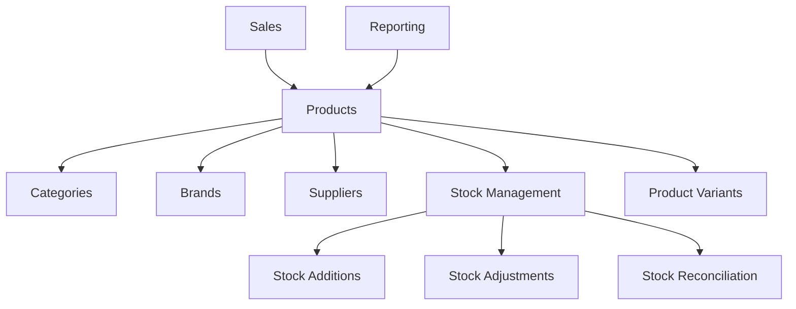

# Inventory Management System

## Overview

The inventory management system is a comprehensive solution for tracking products, managing stock levels, handling suppliers, and maintaining accurate inventory records through advanced reconciliation processes.

## System Architecture

### Core Components



### Key Features

- **Product Catalog Management** - Complete product information with variants
- **Stock Tracking** - Real-time inventory levels and movements
- **Supplier Management** - Vendor relationships and purchase history
- **Reconciliation System** - Physical count vs system count validation
- **Low Stock Alerts** - Automated reorder notifications
- **Historical Reporting** - Stock movement and valuation reports

## Product Management

### Product Model Structure

```typescript
interface Product {
  id: number;
  name: string;
  sku: string;              // Unique stock keeping unit
  barcode?: string;         // Barcode for scanning
  description?: string;
  
  // Pricing
  cost: number;            // Purchase/wholesale cost
  price: number;           // Retail selling price
  
  // Inventory
  stock: number;           // Current stock level
  minStock: number;        // Reorder point
  maxStock?: number;       // Maximum stock level
  unit: string;            // Unit of measurement
  
  // Physical attributes
  weight?: number;
  dimensions?: string;
  color?: string;
  size?: string;
  material?: string;
  
  // Organization
  categoryId?: number;
  brandId?: number;
  supplierId?: number;
  
  // Status and features
  status: ProductStatus;   // ACTIVE, INACTIVE, DISCONTINUED
  isArchived: boolean;     // Soft delete flag
  hasVariants: boolean;    // Whether product has variants
  isService: boolean;      // Service vs physical product
  
  // Metadata
  tags: string[];
  images: any;             // Product images
  wordpress_id?: number;   // External system sync
  
  // Timestamps
  createdAt: DateTime;
  updatedAt: DateTime;
}
```

### Product Creation Process

#### 1. Add Product Form (`AddProductForm.tsx`)

Multi-step form with comprehensive validation:

```typescript
// Form sections
<Form {...form}>
  <BasicInfoSection />           // Name, SKU, description, barcode
  <CategoryBrandSection />       // Category, brand, supplier
  <PricingInventorySection />    // Cost, price, stock levels
  <ProductSpecificationsSection /> // Physical attributes
  <AdditionalInfoSection />      // Tags, images, notes
  <FormActions />               // Submit/cancel buttons
</Form>
```

**Validation Schema:**
```typescript
const createProductSchema = z.object({
  name: z.string().min(1, 'Product name is required'),
  sku: z.string().optional(), // Auto-generated if not provided
  barcode: z.string().optional(),
  description: z.string().optional(),
  
  sellingPrice: z.coerce.number().min(0, 'Price must be positive'),
  purchasePrice: z.coerce.number().min(0, 'Cost must be positive').optional(),
  
  currentStock: z.coerce.number().min(0, 'Stock must be non-negative'),
  minimumStock: z.coerce.number().min(0, 'Minimum stock must be non-negative'),
  maximumStock: z.coerce.number().optional(),
  
  unit: z.string().default('piece'),
  status: z.enum(['ACTIVE', 'INACTIVE', 'DISCONTINUED']),
  
  categoryId: z.coerce.number().optional(),
  brandId: z.coerce.number().optional(),
  supplierId: z.coerce.number().optional(),
  
  tags: z.array(z.string()).default([]),
  weight: z.coerce.number().optional(),
  dimensions: z.string().optional(),
  color: z.string().optional(),
  size: z.string().optional(),
  material: z.string().optional(),
});
```

#### 2. SKU Generation

Automatic SKU generation based on product attributes:

```typescript
function generateSKU(
  productName: string,
  categoryName?: string,
  brandName?: string
): string {
  const nameCode = productName
    .replace(/[^a-zA-Z0-9]/g, '')
    .substring(0, 4)
    .toUpperCase();
  
  const categoryCode = categoryName
    ? categoryName.substring(0, 3).toUpperCase()
    : 'GEN';
  
  const brandCode = brandName
    ? brandName.substring(0, 2).toUpperCase()
    : '';
  
  const randomCode = Math.random().toString(36).substr(2, 4).toUpperCase();
  
  return `${categoryCode}-${brandCode}${nameCode}-${randomCode}`;
}
```

#### 3. Product Validation

Server-side validation ensures data integrity:

```typescript
// Check for duplicate SKU
const existingSKU = await prisma.product.findUnique({
  where: { sku: finalSku }
});

if (existingSKU) {
  return NextResponse.json(
    { error: 'Product with this SKU already exists' },
    { status: 409 }
  );
}

// Check for duplicate barcode
if (barcode) {
  const existingBarcode = await prisma.product.findFirst({
    where: { barcode }
  });
  
  if (existingBarcode) {
    return NextResponse.json(
      { error: 'Product with this barcode already exists' },
      { status: 409 }
    );
  }
}

// Verify relationships exist
if (categoryId) {
  const category = await prisma.category.findUnique({
    where: { id: categoryId }
  });
  
  if (!category) {
    return NextResponse.json(
      { error: 'Category not found' },
      { status: 404 }
    );
  }
}
```

### Product Variants

Support for product variations (size, color, etc.):

```typescript
interface ProductVariant {
  id: number;
  productId: number;         // Parent product
  name: string;             // Variant name
  sku: string;              // Unique variant SKU
  price: number;            // Variant-specific price
  cost?: number;            // Variant-specific cost
  
  // Variant attributes
  color?: string;
  size?: string;
  material?: string;
  weight?: number;
  dimensions?: any;         // JSON field
  images?: any;             // Variant images
  
  // Inventory
  currentStock: number;
  minStockLevel: number;
  maxStockLevel?: number;
  
  // Status
  isActive: boolean;
  
  // Timestamps
  createdAt: DateTime;
  updatedAt: DateTime;
}
```

## Category Management

### Hierarchical Categories

Support for parent-child category relationships:

```typescript
interface Category {
  id: number;
  name: string;
  description?: string;
  parentId?: number;        // Self-referencing for hierarchy
  image?: string;           // Category image
  isActive: boolean;
  wordpress_id?: number;    // External sync
  
  // Relationships
  parent?: Category;        // Parent category
  children: Category[];     // Child categories
  products: Product[];      // Products in this category
  
  // Timestamps
  createdAt: DateTime;
  updatedAt: DateTime;
}
```

### Category Operations

```typescript
// Create category with validation
export async function createCategory(data: CategoryCreateInput) {
  // Validate unique name per parent level
  const existingCategory = await prisma.category.findFirst({
    where: {
      name: data.name,
      parentId: data.parentId || null
    }
  });
  
  if (existingCategory) {
    throw new Error('Category name already exists at this level');
  }
  
  return prisma.category.create({
    data: {
      ...data,
      isActive: true
    }
  });
}

// Get category hierarchy
export async function getCategoryTree() {
  const categories = await prisma.category.findMany({
    where: { isActive: true },
    include: {
      children: {
        include: {
          children: true // Support for 3-level hierarchy
        }
      },
      _count: {
        select: { products: true }
      }
    },
    orderBy: { name: 'asc' }
  });
  
  return categories.filter(cat => !cat.parentId); // Root categories only
}
```

## Brand Management

### Brand Model

```typescript
interface Brand {
  id: number;
  name: string;             // Unique brand name
  description?: string;
  website?: string;
  image?: string;           // Brand logo
  isActive: boolean;
  wordpress_id?: number;    // External sync
  
  // Relationships
  products: Product[];
  
  // Timestamps
  createdAt: DateTime;
  updatedAt: DateTime;
}
```

### Brand Operations

```typescript
// Brand CRUD operations
export const brandOperations = {
  create: async (data: BrandCreateInput) => {
    const existingBrand = await prisma.brand.findUnique({
      where: { name: data.name }
    });
    
    if (existingBrand) {
      throw new Error('Brand already exists');
    }
    
    return prisma.brand.create({ data });
  },
  
  list: async (filters: BrandFilters) => {
    return prisma.brand.findMany({
      where: {
        isActive: true,
        ...(filters.search && {
          OR: [
            { name: { contains: filters.search, mode: 'insensitive' } },
            { description: { contains: filters.search, mode: 'insensitive' } }
          ]
        })
      },
      include: {
        _count: {
          select: { products: true }
        }
      },
      orderBy: { name: 'asc' }
    });
  },
  
  update: async (id: number, data: BrandUpdateInput) => {
    return prisma.brand.update({
      where: { id },
      data: {
        ...data,
        updatedAt: new Date()
      }
    });
  },
  
  delete: async (id: number) => {
    // Soft delete - set isActive to false
    return prisma.brand.update({
      where: { id },
      data: { isActive: false }
    });
  }
};
```

## Supplier Management

### Supplier Model

```typescript
interface Supplier {
  id: number;
  name: string;
  contactPerson?: string;
  email?: string;
  phone?: string;
  address?: string;
  city?: string;
  state?: string;
  website?: string;
  notes?: string;
  
  // Relationships
  products: Product[];
  stockAdditions: StockAddition[];
  
  // Timestamps
  createdAt: DateTime;
  updatedAt: DateTime;
}
```

### Supplier Features

- **Contact Management** - Multiple contact methods
- **Purchase History** - Track all stock additions from supplier
- **Performance Metrics** - Lead times, quality ratings
- **Document Storage** - Contracts, certificates

## Stock Management

### Stock Addition System

Track inventory purchases and additions:

```typescript
interface StockAddition {
  id: number;
  productId: number;
  supplierId?: number;
  
  // Purchase details
  quantity: number;
  costPerUnit: number;        // Unit cost
  totalCost: number;          // Total purchase cost
  purchaseDate: DateTime;     // Purchase date
  referenceNo?: string;       // PO number, invoice number
  notes?: string;
  
  // Audit
  createdById: number;        // Staff member who added
  createdAt: DateTime;
  updatedAt: DateTime;
  
  // Relationships
  createdBy: User;
  product: Product;
  supplier?: Supplier;
}
```

#### Adding Stock Process

```typescript
export async function addStock(data: StockAdditionInput, userId: number) {
  return prisma.$transaction(async (tx) => {
    // Create stock addition record
    const stockAddition = await tx.stockAddition.create({
      data: {
        productId: data.productId,
        supplierId: data.supplierId,
        quantity: data.quantity,
        costPerUnit: data.costPerUnit,
        totalCost: data.quantity * data.costPerUnit,
        purchaseDate: data.purchaseDate,
        referenceNo: data.referenceNo,
        notes: data.notes,
        createdById: userId
      }
    });
    
    // Update product stock level
    await tx.product.update({
      where: { id: data.productId },
      data: {
        stock: {
          increment: data.quantity
        },
        // Update cost if provided
        ...(data.updateCost && {
          cost: data.costPerUnit
        })
      }
    });
    
    // Log audit trail
    await tx.auditLog.create({
      data: {
        action: 'STOCK_ADDED',
        tableName: 'products',
        recordId: data.productId,
        userId,
        newValues: {
          quantityAdded: data.quantity,
          costPerUnit: data.costPerUnit,
          supplierId: data.supplierId
        }
      }
    });
    
    return stockAddition;
  });
}
```

### Stock Adjustment System

Handle manual stock adjustments for corrections:

```typescript
interface StockAdjustment {
  id: number;
  productId?: number;
  variantId?: number;
  
  // Adjustment details
  oldQuantity: number;        // Previous stock level
  newQuantity: number;        // New stock level
  quantity: number;           // Change amount (+ or -)
  adjustmentType: string;     // Type of adjustment
  reason: string;             // Why adjustment was made
  referenceNumber?: string;   // Reference for adjustment
  notes?: string;
  
  // Approval workflow
  status: 'PENDING' | 'APPROVED' | 'REJECTED';
  userId: number;             // Who requested
  approvedBy?: number;        // Who approved
  approvedAt?: DateTime;
  rejectionReason?: string;
  
  // Timestamps
  createdAt: DateTime;
  updatedAt: DateTime;
}
```

#### Stock Adjustment Types

```typescript
export const ADJUSTMENT_TYPES = {
  DAMAGE: 'DAMAGE',           // Damaged goods
  THEFT: 'THEFT',             // Stolen inventory
  LOSS: 'LOSS',               // Lost inventory
  FOUND: 'FOUND',             // Found inventory
  CORRECTION: 'CORRECTION',    // System correction
  EXPIRED: 'EXPIRED',         // Expired products
  RETURN: 'RETURN',           // Customer returns
  GIFT: 'GIFT',               // Promotional gifts
  SAMPLE: 'SAMPLE',           // Sample products
  OTHER: 'OTHER'              // Other reasons
};
```

#### Adjustment Approval Workflow

```typescript
export async function requestStockAdjustment(
  data: StockAdjustmentInput,
  userId: number
) {
  // Get current product stock
  const product = await prisma.product.findUnique({
    where: { id: data.productId },
    select: { stock: true, name: true }
  });
  
  if (!product) {
    throw new Error('Product not found');
  }
  
  // Calculate new quantity
  const newQuantity = Math.max(0, product.stock + data.quantity);
  
  // Create adjustment request
  const adjustment = await prisma.stockAdjustment.create({
    data: {
      productId: data.productId,
      variantId: data.variantId,
      oldQuantity: product.stock,
      newQuantity,
      quantity: data.quantity,
      adjustmentType: data.adjustmentType,
      reason: data.reason,
      referenceNumber: data.referenceNumber,
      notes: data.notes,
      status: 'PENDING',
      userId
    }
  });
  
  // Notify admins for approval if adjustment is significant
  if (Math.abs(data.quantity) > 10) {
    await notifyAdminsForApproval(adjustment);
  }
  
  return adjustment;
}

export async function approveStockAdjustment(
  adjustmentId: number,
  adminId: number
) {
  return prisma.$transaction(async (tx) => {
    const adjustment = await tx.stockAdjustment.findUnique({
      where: { id: adjustmentId },
      include: { products: true }
    });
    
    if (!adjustment || adjustment.status !== 'PENDING') {
      throw new Error('Adjustment not found or already processed');
    }
    
    // Update adjustment status
    await tx.stockAdjustment.update({
      where: { id: adjustmentId },
      data: {
        status: 'APPROVED',
        approvedBy: adminId,
        approvedAt: new Date()
      }
    });
    
    // Apply stock change
    await tx.product.update({
      where: { id: adjustment.productId! },
      data: {
        stock: adjustment.newQuantity
      }
    });
    
    // Log the change
    await tx.auditLog.create({
      data: {
        action: 'STOCK_ADJUSTED',
        tableName: 'products',
        recordId: adjustment.productId,
        userId: adminId,
        oldValues: { stock: adjustment.oldQuantity },
        newValues: { stock: adjustment.newQuantity }
      }
    });
  });
}
```

## Stock Reconciliation System

### Physical Inventory Reconciliation

Compare physical counts with system records:

```typescript
interface StockReconciliation {
  id: number;
  title: string;
  description?: string;
  notes?: string;
  
  // Workflow
  status: 'DRAFT' | 'PENDING' | 'APPROVED' | 'REJECTED';
  
  // Audit
  createdById: number;
  approvedById?: number;
  createdAt: DateTime;
  submittedAt?: DateTime;
  approvedAt?: DateTime;
  updatedAt: DateTime;
  
  // Relationships
  items: StockReconciliationItem[];
  createdBy: User;
  approvedBy?: User;
}

interface StockReconciliationItem {
  id: number;
  reconciliationId: number;
  productId: number;
  
  // Count comparison
  systemCount: number;       // What system shows
  physicalCount: number;     // What was actually counted
  discrepancy: number;       // Difference (physical - system)
  discrepancyReason?: string; // Why there's a difference
  estimatedImpact?: number;  // Financial impact
  notes?: string;
  
  // Relationships
  product: Product;
  reconciliation: StockReconciliation;
}
```

### Reconciliation Process

#### 1. Create Reconciliation Session

```typescript
export async function createReconciliation(
  data: ReconciliationCreateInput,
  userId: number
) {
  return prisma.stockReconciliation.create({
    data: {
      title: data.title,
      description: data.description,
      notes: data.notes,
      status: 'DRAFT',
      createdById: userId
    }
  });
}
```

#### 2. Add Products to Reconciliation

```typescript
export async function addProductsToReconciliation(
  reconciliationId: number,
  productIds: number[]
) {
  const products = await prisma.product.findMany({
    where: {
      id: { in: productIds },
      isArchived: false
    },
    select: { id: true, stock: true, name: true, cost: true }
  });
  
  const reconciliationItems = products.map(product => ({
    reconciliationId,
    productId: product.id,
    systemCount: product.stock,
    physicalCount: 0, // To be filled during count
    discrepancy: -product.stock, // Initial discrepancy
    estimatedImpact: product.cost * product.stock
  }));
  
  return prisma.stockReconciliationItem.createMany({
    data: reconciliationItems
  });
}
```

#### 3. Update Physical Counts

```typescript
export async function updatePhysicalCount(
  itemId: number,
  physicalCount: number,
  discrepancyReason?: string
) {
  const item = await prisma.stockReconciliationItem.findUnique({
    where: { id: itemId },
    include: { product: true }
  });
  
  if (!item) {
    throw new Error('Reconciliation item not found');
  }
  
  const discrepancy = physicalCount - item.systemCount;
  const estimatedImpact = discrepancy * Number(item.product.cost);
  
  return prisma.stockReconciliationItem.update({
    where: { id: itemId },
    data: {
      physicalCount,
      discrepancy,
      estimatedImpact,
      discrepancyReason
    }
  });
}
```

#### 4. Submit for Approval

```typescript
export async function submitReconciliation(reconciliationId: number) {
  const reconciliation = await prisma.stockReconciliation.findUnique({
    where: { id: reconciliationId },
    include: { items: true }
  });
  
  if (!reconciliation || reconciliation.status !== 'DRAFT') {
    throw new Error('Reconciliation not found or not in draft status');
  }
  
  // Validate all items have physical counts
  const incompleteItems = reconciliation.items.filter(
    item => item.physicalCount === 0 && item.systemCount > 0
  );
  
  if (incompleteItems.length > 0) {
    throw new Error('All items must have physical counts entered');
  }
  
  return prisma.stockReconciliation.update({
    where: { id: reconciliationId },
    data: {
      status: 'PENDING',
      submittedAt: new Date()
    }
  });
}
```

#### 5. Approve Reconciliation

```typescript
export async function approveReconciliation(
  reconciliationId: number,
  adminId: number
) {
  return prisma.$transaction(async (tx) => {
    const reconciliation = await tx.stockReconciliation.findUnique({
      where: { id: reconciliationId },
      include: { 
        items: { 
          include: { product: true } 
        } 
      }
    });
    
    if (!reconciliation || reconciliation.status !== 'PENDING') {
      throw new Error('Reconciliation not found or not pending approval');
    }
    
    // Update reconciliation status
    await tx.stockReconciliation.update({
      where: { id: reconciliationId },
      data: {
        status: 'APPROVED',
        approvedById: adminId,
        approvedAt: new Date()
      }
    });
    
    // Apply stock adjustments for items with discrepancies
    for (const item of reconciliation.items) {
      if (item.discrepancy !== 0) {
        // Update product stock
        await tx.product.update({
          where: { id: item.productId },
          data: {
            stock: item.physicalCount
          }
        });
        
        // Create stock adjustment record
        await tx.stockAdjustment.create({
          data: {
            productId: item.productId,
            oldQuantity: item.systemCount,
            newQuantity: item.physicalCount,
            quantity: item.discrepancy,
            adjustmentType: 'RECONCILIATION',
            reason: `Stock reconciliation: ${reconciliation.title}`,
            referenceNumber: `REC-${reconciliation.id}`,
            status: 'APPROVED',
            userId: adminId,
            approvedBy: adminId,
            approvedAt: new Date()
          }
        });
        
        // Log audit trail
        await tx.auditLog.create({
          data: {
            action: 'STOCK_RECONCILIATION_APPLIED',
            tableName: 'products',
            recordId: item.productId,
            userId: adminId,
            oldValues: { stock: item.systemCount },
            newValues: { 
              stock: item.physicalCount,
              reconciliationId: reconciliation.id 
            }
          }
        });
      }
    }
  });
}
```

## Low Stock Management

### Low Stock Detection

```typescript
export async function getLowStockProducts(threshold?: number) {
  const products = await prisma.product.findMany({
    where: {
      isArchived: false,
      status: 'ACTIVE',
      // Use raw query for field comparison since Prisma doesn't support it
    },
    include: {
      category: { select: { name: true } },
      brand: { select: { name: true } },
      supplier: { select: { name: true, email: true, phone: true } }
    }
  });
  
  // Filter in memory for field-to-field comparison
  return products.filter(product => {
    const minThreshold = threshold || product.minStock || 0;
    return product.stock <= minThreshold;
  });
}
```

### Automated Alerts

```typescript
export async function sendLowStockAlerts() {
  const lowStockProducts = await getLowStockProducts();
  
  if (lowStockProducts.length === 0) {
    return { message: 'No low stock items found' };
  }
  
  // Group by supplier for targeted notifications
  const productsBySupplier = lowStockProducts.reduce((acc, product) => {
    const supplierId = product.supplierId || 0;
    if (!acc[supplierId]) {
      acc[supplierId] = [];
    }
    acc[supplierId].push(product);
    return acc;
  }, {} as Record<number, typeof lowStockProducts>);
  
  // Send notifications to admins
  const adminUsers = await prisma.user.findMany({
    where: { role: 'ADMIN', isActive: true },
    select: { email: true }
  });
  
  if (adminUsers.length > 0) {
    await emailService.sendLowStockAlert(
      adminUsers.map(admin => admin.email),
      {
        lowStockCount: lowStockProducts.length,
        products: lowStockProducts.map(p => ({
          name: p.name,
          sku: p.sku,
          currentStock: p.stock,
          minStock: p.minStock,
          supplier: p.supplier?.name
        })),
        dashboardLink: `${process.env.NEXT_PUBLIC_APP_URL}/inventory`
      }
    );
  }
  
  return {
    message: `Low stock alert sent for ${lowStockProducts.length} products`,
    productCount: lowStockProducts.length
  };
}
```

## Inventory Reporting

### Stock Valuation Report

```typescript
export async function generateStockValuationReport(asOfDate?: Date) {
  const products = await prisma.product.findMany({
    where: {
      isArchived: false,
      stock: { gt: 0 }
    },
    include: {
      category: { select: { name: true } },
      brand: { select: { name: true } }
    }
  });
  
  const report = {
    generatedAt: new Date(),
    asOfDate: asOfDate || new Date(),
    totalProducts: products.length,
    totalUnits: products.reduce((sum, p) => sum + p.stock, 0),
    totalValue: products.reduce((sum, p) => sum + (p.stock * Number(p.cost)), 0),
    categories: {} as Record<string, any>,
    products: products.map(product => ({
      id: product.id,
      name: product.name,
      sku: product.sku,
      category: product.category?.name,
      brand: product.brand?.name,
      stock: product.stock,
      cost: Number(product.cost),
      totalValue: product.stock * Number(product.cost)
    }))
  };
  
  // Group by category
  products.forEach(product => {
    const categoryName = product.category?.name || 'Uncategorized';
    if (!report.categories[categoryName]) {
      report.categories[categoryName] = {
        productCount: 0,
        totalUnits: 0,
        totalValue: 0
      };
    }
    
    report.categories[categoryName].productCount++;
    report.categories[categoryName].totalUnits += product.stock;
    report.categories[categoryName].totalValue += product.stock * Number(product.cost);
  });
  
  return report;
}
```

### Stock Movement Report

```typescript
export async function generateStockMovementReport(
  startDate: Date,
  endDate: Date,
  productId?: number
) {
  const stockAdditions = await prisma.stockAddition.findMany({
    where: {
      purchaseDate: { gte: startDate, lte: endDate },
      ...(productId && { productId })
    },
    include: {
      product: { select: { name: true, sku: true } },
      supplier: { select: { name: true } },
      createdBy: { select: { firstName: true, lastName: true } }
    }
  });
  
  const stockAdjustments = await prisma.stockAdjustment.findMany({
    where: {
      createdAt: { gte: startDate, lte: endDate },
      status: 'APPROVED',
      ...(productId && { productId })
    },
    include: {
      products: { select: { name: true, sku: true } }
    }
  });
  
  const salesItems = await prisma.salesItem.findMany({
    where: {
      createdAt: { gte: startDate, lte: endDate },
      ...(productId && { productId })
    },
    include: {
      products: { select: { name: true, sku: true } },
      salesTransactions: { 
        select: { 
          transactionNumber: true,
          createdAt: true 
        } 
      }
    }
  });
  
  return {
    period: { startDate, endDate },
    summary: {
      totalAdditions: stockAdditions.reduce((sum, add) => sum + add.quantity, 0),
      totalAdjustments: stockAdjustments.reduce((sum, adj) => sum + adj.quantity, 0),
      totalSales: salesItems.reduce((sum, item) => sum + item.quantity, 0)
    },
    movements: [
      ...stockAdditions.map(add => ({
        type: 'ADDITION',
        date: add.purchaseDate,
        product: add.product,
        quantity: add.quantity,
        reference: add.referenceNo,
        source: add.supplier?.name,
        user: `${add.createdBy.firstName} ${add.createdBy.lastName}`
      })),
      ...stockAdjustments.map(adj => ({
        type: 'ADJUSTMENT',
        date: adj.createdAt,
        product: adj.products,
        quantity: adj.quantity,
        reference: adj.referenceNumber,
        reason: adj.reason
      })),
      ...salesItems.map(item => ({
        type: 'SALE',
        date: item.createdAt,
        product: item.products,
        quantity: -item.quantity, // Negative for sales
        reference: item.salesTransactions.transactionNumber
      }))
    ].sort((a, b) => b.date.getTime() - a.date.getTime())
  };
}
```

## Integration Features

### Barcode Integration

Support for barcode scanning in inventory management:

```typescript
export async function lookupProductByBarcode(barcode: string) {
  const product = await prisma.product.findFirst({
    where: {
      barcode,
      isArchived: false
    },
    include: {
      category: { select: { name: true } },
      brand: { select: { name: true } }
    }
  });
  
  if (!product) {
    return null;
  }
  
  return {
    id: product.id,
    name: product.name,
    sku: product.sku,
    barcode: product.barcode,
    price: Number(product.price),
    stock: product.stock,
    minStock: product.minStock,
    category: product.category?.name,
    brand: product.brand?.name,
    status: product.status
  };
}
```

### WordPress Integration

Sync with WooCommerce for e-commerce:

```typescript
export async function syncWithWordPress(productId: number) {
  const product = await prisma.product.findUnique({
    where: { id: productId },
    include: {
      category: true,
      brand: true
    }
  });
  
  if (!product) {
    throw new Error('Product not found');
  }
  
  const wordpressData = {
    name: product.name,
    description: product.description,
    regular_price: product.price.toString(),
    stock_quantity: product.stock,
    manage_stock: true,
    sku: product.sku,
    categories: product.category ? [{ name: product.category.name }] : [],
    meta_data: [
      { key: 'brand', value: product.brand?.name || '' },
      { key: 'internal_id', value: product.id.toString() }
    ]
  };
  
  // Implementation would connect to WordPress API
  // Return sync result
  return { success: true, wordpress_id: 123 };
}
```

---

This inventory management system provides comprehensive tracking, validation, and reporting capabilities suitable for businesses of all sizes, with robust audit trails and approval workflows for sensitive operations.