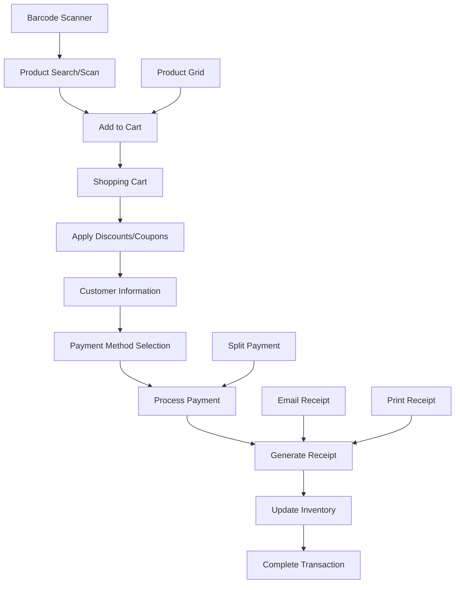

# Point of Sale (POS) System

## Overview

The POS system provides a complete transaction processing interface with barcode scanning, customer management, multiple payment methods, coupon support, and comprehensive receipt generation.

## POS Architecture

### System Flow



### Key Features

- **Real-time Product Search** - Fast product lookup and selection
- **Barcode Scanning** - Camera and hardware scanner support
- **Customer Management** - Customer data collection and history
- **Multiple Payment Methods** - Cash, card, mobile, split payments
- **Coupon System** - Percentage and fixed amount discounts
- **Receipt Generation** - Email and thermal printing
- **Offline Support** - Transaction queuing when offline
- **Inventory Integration** - Real-time stock updates

## POS Interface Components

### Main POS Interface (`POSInterface.tsx`)

```typescript
interface CartItem {
  id: number;
  name: string;
  sku: string;
  price: number;
  quantity: number;
  stock: number;
  category?: string;
  brand?: string;
}

export function POSInterface() {
  const [cart, setCart] = useState<CartItem[]>([]);
  const [currentStep, setCurrentStep] = useState<'search' | 'payment' | 'receipt'>('search');
  const [discount, setDiscount] = useState(0);
  const [fees, setFees] = useState<Array<FeeType>>([]);
  const [customerInfo, setCustomerInfo] = useState(defaultCustomerInfo);

  // Calculate totals using utility function
  const { subtotal, total: baseTotal } = calculateOrderTotals(cart, discount);
  const feesTotal = fees.reduce((sum, fee) => sum + fee.amount, 0);
  const total = baseTotal + feesTotal;

  return (
    <POSErrorBoundary>
      <div className="grid h-screen grid-cols-1 lg:grid-cols-12">
        {/* Product selection area */}
        <div className="lg:col-span-7">
          <ProductSearchBar onProductSelect={addToCart} />
          <ProductGrid onAddToCart={addToCart} />
          <BarcodeScanner onScan={handleBarcodeScan} />
        </div>
        
        {/* Cart and checkout area */}
        <div className="lg:col-span-5">
          <ShoppingCart
            items={cart}
            onUpdateQuantity={updateQuantity}
            onRemoveItem={removeFromCart}
            discount={discount}
            fees={fees}
          />
          
          <SlidingPaymentInterface
            isOpen={currentStep === 'payment'}
            cart={cart}
            subtotal={subtotal}
            discount={discount}
            fees={fees}
            total={total}
            customerInfo={customerInfo}
            onClose={() => setCurrentStep('search')}
            onPaymentComplete={handlePaymentComplete}
          />
        </div>
      </div>
    </POSErrorBoundary>
  );
}
```

### Product Search & Selection

#### ProductSearchBar Component

```typescript
export function ProductSearchBar({ onProductSelect }: Props) {
  const [query, setQuery] = useState('');
  const [results, setResults] = useState<Product[]>([]);
  const [isLoading, setIsLoading] = useState(false);

  const searchProducts = useDebouncedCallback(async (searchQuery: string) => {
    if (!searchQuery.trim()) {
      setResults([]);
      return;
    }

    setIsLoading(true);
    try {
      const response = await fetch(`/api/pos/search-products?q=${encodeURIComponent(searchQuery)}`);
      const data = await response.json();
      
      if (data.success) {
        setResults(data.products);
      }
    } catch (error) {
      console.error('Product search failed:', error);
      toast.error('Failed to search products');
    } finally {
      setIsLoading(false);
    }
  }, 300);

  return (
    <div className="relative">
      <div className="relative">
        <Search className="absolute left-3 top-1/2 h-4 w-4 -translate-y-1/2 text-muted-foreground" />
        <Input
          type="text"
          placeholder="Search products by name, SKU, or barcode..."
          value={query}
          onChange={(e) => {
            setQuery(e.target.value);
            searchProducts(e.target.value);
          }}
          className="pl-10 pr-4"
        />
      </div>

      {/* Search Results Dropdown */}
      {results.length > 0 && (
        <div className="absolute top-full left-0 right-0 mt-1 bg-white border rounded-md shadow-lg max-h-60 overflow-y-auto z-50">
          {results.map((product) => (
            <button
              key={product.id}
              onClick={() => {
                onProductSelect(product);
                setQuery('');
                setResults([]);
              }}
              className="w-full px-4 py-3 text-left hover:bg-gray-50 border-b last:border-b-0"
            >
              <div className="flex justify-between items-center">
                <div>
                  <div className="font-medium">{product.name}</div>
                  <div className="text-sm text-gray-500">
                    {product.sku} • Stock: {product.stock}
                  </div>
                </div>
                <div className="text-right">
                  <div className="font-medium">{formatCurrency(product.price)}</div>
                  <div className="text-sm text-gray-500">{product.category}</div>
                </div>
              </div>
            </button>
          ))}
        </div>
      )}
    </div>
  );
}
```

#### ProductGrid Component

```typescript
export function ProductGrid({ onAddToCart }: Props) {
  const [products, setProducts] = useState<Product[]>([]);
  const [categories, setCategories] = useState<Category[]>([]);
  const [selectedCategory, setSelectedCategory] = useState<number | null>(null);
  const [loading, setLoading] = useState(true);

  // Fetch products and categories
  useEffect(() => {
    loadProductsAndCategories();
  }, [selectedCategory]);

  const loadProductsAndCategories = async () => {
    setLoading(true);
    try {
      const [productsRes, categoriesRes] = await Promise.all([
        fetch(`/api/pos/products?${selectedCategory ? `categoryId=${selectedCategory}` : ''}`),
        fetch('/api/categories/simple')
      ]);

      const [productsData, categoriesData] = await Promise.all([
        productsRes.json(),
        categoriesRes.json()
      ]);

      if (productsData.success) {
        setProducts(productsData.products);
      }
      if (categoriesData.success) {
        setCategories(categoriesData.categories);
      }
    } catch (error) {
      console.error('Failed to load products:', error);
      toast.error('Failed to load products');
    } finally {
      setLoading(false);
    }
  };

  return (
    <div className="flex-1 flex flex-col">
      {/* Category Filter */}
      <div className="p-4 border-b">
        <div className="flex gap-2 overflow-x-auto">
          <Button
            variant={selectedCategory === null ? 'default' : 'outline'}
            size="sm"
            onClick={() => setSelectedCategory(null)}
          >
            All
          </Button>
          {categories.map((category) => (
            <Button
              key={category.id}
              variant={selectedCategory === category.id ? 'default' : 'outline'}
              size="sm"
              onClick={() => setSelectedCategory(category.id)}
            >
              {category.name}
            </Button>
          ))}
        </div>
      </div>

      {/* Product Grid */}
      <div className="flex-1 p-4">
        {loading ? (
          <div className="grid grid-cols-2 md:grid-cols-3 lg:grid-cols-4 gap-4">
            {Array.from({ length: 8 }).map((_, i) => (
              <Card key={i} className="p-4">
                <Skeleton className="h-20 w-full mb-2" />
                <Skeleton className="h-4 w-3/4 mb-1" />
                <Skeleton className="h-4 w-1/2" />
              </Card>
            ))}
          </div>
        ) : (
          <div className="grid grid-cols-2 md:grid-cols-3 lg:grid-cols-4 gap-4">
            {products.map((product) => (
              <ProductCard
                key={product.id}
                product={product}
                onAddToCart={() => onAddToCart(product)}
              />
            ))}
          </div>
        )}
      </div>
    </div>
  );
}
```

### Barcode Scanner Integration

#### BarcodeScanner Component

```typescript
export function BarcodeScanner({ onScan }: Props) {
  const [isScanning, setIsScanning] = useState(false);
  const [lastScan, setLastScan] = useState<string>('');
  const scannerRef = useRef<Html5QrcodeScanner | null>(null);

  const startScanner = useCallback(() => {
    if (!isScanning) {
      setIsScanning(true);
      
      // Initialize HTML5 QR Code scanner
      const scanner = new Html5QrcodeScanner(
        "barcode-scanner",
        { 
          fps: 10, 
          qrbox: { width: 250, height: 150 },
          aspectRatio: 1.0
        },
        false
      );

      scanner.render(onScanSuccess, onScanError);
      scannerRef.current = scanner;
    }
  }, [isScanning]);

  const stopScanner = useCallback(() => {
    if (scannerRef.current && isScanning) {
      scannerRef.current.clear().then(() => {
        setIsScanning(false);
        scannerRef.current = null;
      });
    }
  }, [isScanning]);

  const onScanSuccess = useCallback(async (decodedText: string) => {
    // Avoid duplicate scans
    if (decodedText === lastScan) return;
    
    setLastScan(decodedText);
    
    try {
      // Look up product by barcode
      const response = await fetch(`/api/pos/barcode-lookup?barcode=${encodeURIComponent(decodedText)}`);
      const data = await response.json();
      
      if (data.success && data.product) {
        onScan(data.product);
        toast.success(`Product found: ${data.product.name}`);
        
        // Stop scanning after successful scan
        stopScanner();
      } else {
        toast.error('Product not found');
      }
    } catch (error) {
      console.error('Barcode lookup failed:', error);
      toast.error('Failed to lookup product');
    }
  }, [lastScan, onScan, stopScanner]);

  const onScanError = useCallback((error: string) => {
    // Only log actual errors, not "QR code parse error"
    if (!error.includes('QR code parse error')) {
      console.warn('Barcode scan error:', error);
    }
  }, []);

  return (
    <div className="border-t bg-white">
      <div className="p-4">
        <div className="flex items-center justify-between mb-4">
          <h3 className="font-medium">Barcode Scanner</h3>
          <Button
            variant={isScanning ? 'destructive' : 'default'}
            size="sm"
            onClick={isScanning ? stopScanner : startScanner}
          >
            <Camera className="mr-2 h-4 w-4" />
            {isScanning ? 'Stop Scanner' : 'Start Scanner'}
          </Button>
        </div>
        
        {/* Scanner container */}
        <div id="barcode-scanner" className={isScanning ? 'block' : 'hidden'} />
        
        {!isScanning && (
          <div className="text-center py-8 text-muted-foreground">
            <Camera className="mx-auto h-12 w-12 mb-2 opacity-50" />
            <p>Click "Start Scanner" to scan product barcodes</p>
          </div>
        )}
      </div>
    </div>
  );
}
```

### Shopping Cart Management

#### ShoppingCart Component

```typescript
export function ShoppingCart({
  items,
  onUpdateQuantity,
  onRemoveItem,
  discount,
  fees
}: Props) {
  const { subtotal, total } = calculateOrderTotals(items, discount);
  const feesTotal = fees.reduce((sum, fee) => sum + fee.amount, 0);
  const finalTotal = total + feesTotal;

  return (
    <Card className="h-full flex flex-col">
      <CardHeader className="pb-3">
        <CardTitle className="flex items-center justify-between">
          <span>Shopping Cart</span>
          <Badge variant="secondary">{items.length} items</Badge>
        </CardTitle>
      </CardHeader>

      <CardContent className="flex-1 overflow-hidden">
        {items.length === 0 ? (
          <div className="flex flex-col items-center justify-center h-full text-muted-foreground">
            <ShoppingCart className="h-12 w-12 mb-2 opacity-50" />
            <p>Cart is empty</p>
            <p className="text-sm">Add products to get started</p>
          </div>
        ) : (
          <ScrollArea className="h-full">
            <div className="space-y-3">
              {items.map((item) => (
                <CartItem
                  key={item.id}
                  item={item}
                  onUpdateQuantity={(quantity) => onUpdateQuantity(item.id, quantity)}
                  onRemove={() => onRemoveItem(item.id)}
                />
              ))}
            </div>
          </ScrollArea>
        )}
      </CardContent>

      {items.length > 0 && (
        <CardFooter className="flex-col space-y-3 pt-3">
          {/* Order Summary */}
          <div className="w-full space-y-2 text-sm">
            <div className="flex justify-between">
              <span>Subtotal:</span>
              <span>{formatCurrency(subtotal)}</span>
            </div>
            
            {discount > 0 && (
              <div className="flex justify-between text-green-600">
                <span>Discount:</span>
                <span>-{formatCurrency(discount)}</span>
              </div>
            )}
            
            {fees.map((fee, index) => (
              <div key={index} className="flex justify-between text-orange-600">
                <span>{fee.description || fee.feeType}:</span>
                <span>+{formatCurrency(fee.amount)}</span>
              </div>
            ))}
            
            <Separator />
            
            <div className="flex justify-between font-medium text-lg">
              <span>Total:</span>
              <span>{formatCurrency(finalTotal)}</span>
            </div>
          </div>

          <Button className="w-full" size="lg">
            Checkout ({formatCurrency(finalTotal)})
          </Button>
        </CardFooter>
      )}
    </Card>
  );
}
```

### Payment Processing

#### SlidingPaymentInterface Component

Multi-step payment process with customer info, discounts, and payment methods:

```typescript
export function SlidingPaymentInterface({
  isOpen,
  cart,
  subtotal,
  discount,
  fees,
  total,
  customerInfo,
  onClose,
  onPaymentComplete
}: Props) {
  const [currentStep, setCurrentStep] = useState(1);
  const [paymentMethod, setPaymentMethod] = useState('CASH');
  const [splitPayments, setSplitPayments] = useState<SplitPayment[]>([]);
  const [isProcessing, setIsProcessing] = useState(false);

  const steps = [
    { id: 1, title: 'Customer Info', component: CustomerInfoStep },
    { id: 2, title: 'Discounts', component: DiscountStep },
    { id: 3, title: 'Fees', component: CustomFeesStep },
    { id: 4, title: 'Payment', component: PaymentMethodStep },
    { id: 5, title: 'Review', component: OrderSummaryStep }
  ];

  const processPayment = async () => {
    setIsProcessing(true);
    
    try {
      const paymentData = {
        items: cart.map(item => ({
          productId: item.id,
          quantity: item.quantity,
          price: item.price,
          total: item.price * item.quantity
        })),
        subtotal,
        discount,
        fees,
        total,
        paymentMethod,
        customerInfo,
        ...(paymentMethod === 'split' && { splitPayments }),
        notes: ''
      };

      const response = await fetch('/api/pos/create-sale', {
        method: 'POST',
        headers: { 'Content-Type': 'application/json' },
        body: JSON.stringify(paymentData)
      });

      const result = await response.json();

      if (result.success) {
        toast.success('Payment processed successfully!');
        onPaymentComplete(result);
        onClose();
      } else {
        toast.error(result.error || 'Payment failed');
      }
    } catch (error) {
      console.error('Payment processing error:', error);
      toast.error('Payment processing failed');
    } finally {
      setIsProcessing(false);
    }
  };

  return (
    <Sheet open={isOpen} onOpenChange={onClose}>
      <SheetContent side="right" className="w-full sm:max-w-lg">
        <SheetHeader>
          <SheetTitle>Checkout Process</SheetTitle>
          <SheetDescription>
            Complete the payment process
          </SheetDescription>
        </SheetHeader>

        {/* Step Progress Indicator */}
        <div className="flex items-center justify-between py-4">
          {steps.map((step, index) => (
            <div
              key={step.id}
              className={`flex items-center ${
                index < steps.length - 1 ? 'flex-1' : ''
              }`}
            >
              <div
                className={`w-8 h-8 rounded-full flex items-center justify-center text-sm font-medium ${
                  step.id <= currentStep
                    ? 'bg-primary text-primary-foreground'
                    : 'bg-muted text-muted-foreground'
                }`}
              >
                {step.id}
              </div>
              {index < steps.length - 1 && (
                <div
                  className={`flex-1 h-px mx-2 ${
                    step.id < currentStep ? 'bg-primary' : 'bg-muted'
                  }`}
                />
              )}
            </div>
          ))}
        </div>

        {/* Current Step Content */}
        <div className="flex-1 py-4">
          {currentStep === 1 && (
            <CustomerInfoStep
              customerInfo={customerInfo}
              onUpdate={setCustomerInfo}
            />
          )}
          {currentStep === 2 && (
            <DiscountStep
              discount={discount}
              subtotal={subtotal}
              onUpdate={setDiscount}
            />
          )}
          {currentStep === 3 && (
            <CustomFeesStep
              fees={fees}
              onUpdate={setFees}
            />
          )}
          {currentStep === 4 && (
            <PaymentMethodStep
              paymentMethod={paymentMethod}
              splitPayments={splitPayments}
              total={total}
              onPaymentMethodChange={setPaymentMethod}
              onSplitPaymentsChange={setSplitPayments}
            />
          )}
          {currentStep === 5 && (
            <OrderSummaryStep
              cart={cart}
              customerInfo={customerInfo}
              paymentMethod={paymentMethod}
              splitPayments={splitPayments}
              subtotal={subtotal}
              discount={discount}
              fees={fees}
              total={total}
            />
          )}
        </div>

        {/* Navigation Buttons */}
        <div className="flex gap-2 pt-4 border-t">
          <Button
            variant="outline"
            onClick={() => {
              if (currentStep > 1) {
                setCurrentStep(currentStep - 1);
              } else {
                onClose();
              }
            }}
            disabled={isProcessing}
          >
            {currentStep === 1 ? 'Cancel' : 'Back'}
          </Button>
          
          <Button
            className="flex-1"
            onClick={() => {
              if (currentStep < steps.length) {
                setCurrentStep(currentStep + 1);
              } else {
                processPayment();
              }
            }}
            disabled={isProcessing}
          >
            {isProcessing ? (
              <>
                <Loader2 className="mr-2 h-4 w-4 animate-spin" />
                Processing...
              </>
            ) : currentStep === steps.length ? (
              'Complete Payment'
            ) : (
              'Next'
            )}
          </Button>
        </div>
      </SheetContent>
    </Sheet>
  );
}
```

### Customer Management

#### Customer Information Collection

```typescript
interface CustomerInfo {
  name: string;
  phone: string;
  email: string;
  billingAddress: string;
  shippingAddress: string;
  city: string;
  state: string;
  postalCode: string;
  country: string;
  customerType: 'individual' | 'business';
  notes: string;
}

export function CustomerInfoStep({ customerInfo, onUpdate }: Props) {
  const form = useForm({
    resolver: zodResolver(customerInfoSchema),
    defaultValues: customerInfo
  });

  return (
    <div className="space-y-4">
      <div className="flex items-center justify-between">
        <h3 className="font-medium">Customer Information</h3>
        <Button
          type="button"
          variant="outline"
          size="sm"
          onClick={() => form.reset()}
        >
          Clear
        </Button>
      </div>

      <Form {...form}>
        <div className="space-y-4">
          <FormField
            control={form.control}
            name="name"
            render={({ field }) => (
              <FormItem>
                <FormLabel>Customer Name</FormLabel>
                <FormControl>
                  <Input placeholder="John Doe" {...field} />
                </FormControl>
                <FormMessage />
              </FormItem>
            )}
          />

          <div className="grid grid-cols-2 gap-4">
            <FormField
              control={form.control}
              name="phone"
              render={({ field }) => (
                <FormItem>
                  <FormLabel>Phone</FormLabel>
                  <FormControl>
                    <Input placeholder="+234 123 456 7890" {...field} />
                  </FormControl>
                  <FormMessage />
                </FormItem>
              )}
            />

            <FormField
              control={form.control}
              name="email"
              render={({ field }) => (
                <FormItem>
                  <FormLabel>Email</FormLabel>
                  <FormControl>
                    <Input type="email" placeholder="john@example.com" {...field} />
                  </FormControl>
                  <FormMessage />
                </FormItem>
              )}
            />
          </div>

          <FormField
            control={form.control}
            name="billingAddress"
            render={({ field }) => (
              <FormItem>
                <FormLabel>Address</FormLabel>
                <FormControl>
                  <Textarea placeholder="123 Main Street" {...field} />
                </FormControl>
                <FormMessage />
              </FormItem>
            )}
          />

          <div className="grid grid-cols-3 gap-4">
            <FormField
              control={form.control}
              name="city"
              render={({ field }) => (
                <FormItem>
                  <FormLabel>City</FormLabel>
                  <FormControl>
                    <Input placeholder="Lagos" {...field} />
                  </FormControl>
                  <FormMessage />
                </FormItem>
              )}
            />

            <FormField
              control={form.control}
              name="state"
              render={({ field }) => (
                <FormItem>
                  <FormLabel>State</FormLabel>
                  <FormControl>
                    <Select value={field.value} onValueChange={field.onChange}>
                      <SelectTrigger>
                        <SelectValue placeholder="Select state" />
                      </SelectTrigger>
                      <SelectContent>
                        {NIGERIAN_STATES.map(state => (
                          <SelectItem key={state} value={state}>{state}</SelectItem>
                        ))}
                      </SelectContent>
                    </Select>
                  </FormControl>
                  <FormMessage />
                </FormItem>
              )}
            />

            <FormField
              control={form.control}
              name="postalCode"
              render={({ field }) => (
                <FormItem>
                  <FormLabel>Postal Code</FormLabel>
                  <FormControl>
                    <Input placeholder="100001" {...field} />
                  </FormControl>
                  <FormMessage />
                </FormItem>
              )}
            />
          </div>
        </div>
      </Form>
    </div>
  );
}
```

### Coupon System

#### Coupon Management

```typescript
interface Coupon {
  id: number;
  code: string;
  name: string;
  description?: string;
  type: 'PERCENTAGE' | 'FIXED';
  value: number;
  minimumAmount?: number;
  maxUses?: number;
  currentUses: number;
  isActive: boolean;
  validFrom: DateTime;
  validUntil: DateTime;
}

export function CouponInput({ onApplyCoupon }: Props) {
  const [couponCode, setCouponCode] = useState('');
  const [isValidating, setIsValidating] = useState(false);
  const [appliedCoupon, setAppliedCoupon] = useState<Coupon | null>(null);

  const validateCoupon = async (code: string) => {
    if (!code.trim()) return;

    setIsValidating(true);
    try {
      const response = await fetch('/api/pos/coupons/validate', {
        method: 'POST',
        headers: { 'Content-Type': 'application/json' },
        body: JSON.stringify({ code })
      });

      const result = await response.json();

      if (result.success) {
        setAppliedCoupon(result.coupon);
        onApplyCoupon(result.coupon);
        toast.success(`Coupon applied: ${result.coupon.name}`);
      } else {
        toast.error(result.error || 'Invalid coupon code');
      }
    } catch (error) {
      toast.error('Failed to validate coupon');
    } finally {
      setIsValidating(false);
    }
  };

  const removeCoupon = () => {
    setAppliedCoupon(null);
    setCouponCode('');
    onApplyCoupon(null);
  };

  return (
    <div className="space-y-2">
      <Label>Coupon Code</Label>
      
      {appliedCoupon ? (
        <div className="flex items-center justify-between p-3 bg-green-50 border border-green-200 rounded-md">
          <div>
            <p className="font-medium text-green-800">{appliedCoupon.name}</p>
            <p className="text-sm text-green-600">
              {appliedCoupon.type === 'PERCENTAGE' 
                ? `${appliedCoupon.value}% off`
                : `₦${appliedCoupon.value} off`}
            </p>
          </div>
          <Button
            variant="ghost"
            size="sm"
            onClick={removeCoupon}
          >
            <X className="h-4 w-4" />
          </Button>
        </div>
      ) : (
        <div className="flex gap-2">
          <Input
            value={couponCode}
            onChange={(e) => setCouponCode(e.target.value.toUpperCase())}
            placeholder="Enter coupon code"
            onKeyDown={(e) => {
              if (e.key === 'Enter') {
                validateCoupon(couponCode);
              }
            }}
          />
          <Button
            onClick={() => validateCoupon(couponCode)}
            disabled={!couponCode.trim() || isValidating}
          >
            {isValidating ? (
              <Loader2 className="h-4 w-4 animate-spin" />
            ) : (
              'Apply'
            )}
          </Button>
        </div>
      )}
    </div>
  );
}
```

### Receipt Generation

#### Receipt System

```typescript
export class ReceiptGenerator {
  static generateReceiptData(
    transaction: SalesTransaction,
    items: SalesItem[],
    customer?: Customer
  ) {
    return {
      transactionId: transaction.id,
      transactionNumber: transaction.transaction_number,
      date: transaction.created_at,
      
      // Customer info
      customer: customer ? {
        name: customer.name,
        phone: customer.phone,
        email: customer.email
      } : null,
      
      // Items
      items: items.map(item => ({
        name: item.products?.name || 'Unknown Product',
        quantity: item.quantity,
        price: Number(item.unit_price),
        total: Number(item.total_price)
      })),
      
      // Totals
      subtotal: Number(transaction.subtotal),
      discount: Number(transaction.discount_amount),
      total: Number(transaction.total_amount),
      
      // Payment
      paymentMethod: transaction.payment_method,
      
      // Store info
      store: {
        name: 'Your Store Name',
        address: '123 Business Street',
        phone: '+234 123 456 7890',
        email: 'info@yourstore.com'
      }
    };
  }

  static async generateEmailReceipt(receiptData: ReceiptData) {
    return emailService.sendReceiptEmail({
      to: receiptData.customer?.email,
      customerName: receiptData.customer?.name || 'Customer',
      saleId: receiptData.transactionId.toString(),
      items: receiptData.items,
      subtotal: receiptData.subtotal,
      discount: receiptData.discount,
      total: receiptData.total,
      paymentMethod: receiptData.paymentMethod,
      timestamp: receiptData.date
    });
  }

  static generateThermalReceipt(receiptData: ReceiptData) {
    // Format receipt for thermal printer
    const receiptText = [
      '================================',
      receiptData.store.name.toUpperCase(),
      receiptData.store.address,
      receiptData.store.phone,
      '================================',
      '',
      `Receipt: ${receiptData.transactionNumber}`,
      `Date: ${format(receiptData.date, 'PPpp')}`,
      '',
      '--------------------------------',
      'ITEMS:',
      '--------------------------------',
      ...receiptData.items.map(item => [
        `${item.name}`,
        `${item.quantity} x ${formatCurrency(item.price)} = ${formatCurrency(item.total)}`
      ].join('\n')),
      '',
      '--------------------------------',
      `Subtotal: ${formatCurrency(receiptData.subtotal)}`,
      ...(receiptData.discount > 0 ? [`Discount: -${formatCurrency(receiptData.discount)}`] : []),
      `TOTAL: ${formatCurrency(receiptData.total)}`,
      '',
      `Payment: ${receiptData.paymentMethod}`,
      '',
      'Thank you for your business!',
      '================================'
    ].join('\n');

    return receiptText;
  }
}
```

### Offline Support

#### Offline Transaction Management

```typescript
export function useOffline() {
  const [isOnline, setIsOnline] = useState(navigator.onLine);
  const [queuedTransactions, setQueuedTransactions] = useState<Transaction[]>([]);

  useEffect(() => {
    const handleOnline = () => setIsOnline(true);
    const handleOffline = () => setIsOnline(false);

    window.addEventListener('online', handleOnline);
    window.addEventListener('offline', handleOffline);

    return () => {
      window.removeEventListener('online', handleOnline);
      window.removeEventListener('offline', handleOffline);
    };
  }, []);

  const queueTransaction = useCallback((transactionData: TransactionData) => {
    const queuedTransaction = {
      id: `offline_${Date.now()}`,
      data: transactionData,
      timestamp: new Date(),
      status: 'queued' as const
    };

    setQueuedTransactions(prev => [...prev, queuedTransaction]);
    
    // Store in localStorage for persistence
    const stored = localStorage.getItem('queuedTransactions') || '[]';
    const transactions = JSON.parse(stored);
    transactions.push(queuedTransaction);
    localStorage.setItem('queuedTransactions', JSON.stringify(transactions));

    toast.info('Transaction queued for when connection is restored');
  }, []);

  const processQueuedTransactions = useCallback(async () => {
    if (!isOnline || queuedTransactions.length === 0) return;

    const successful: string[] = [];
    const failed: string[] = [];

    for (const transaction of queuedTransactions) {
      try {
        const response = await fetch('/api/pos/create-sale', {
          method: 'POST',
          headers: { 'Content-Type': 'application/json' },
          body: JSON.stringify(transaction.data)
        });

        if (response.ok) {
          successful.push(transaction.id);
        } else {
          failed.push(transaction.id);
        }
      } catch (error) {
        failed.push(transaction.id);
      }
    }

    // Update queued transactions
    setQueuedTransactions(prev => 
      prev.filter(t => !successful.includes(t.id))
    );

    // Update localStorage
    const remaining = queuedTransactions.filter(t => !successful.includes(t.id));
    localStorage.setItem('queuedTransactions', JSON.stringify(remaining));

    if (successful.length > 0) {
      toast.success(`${successful.length} queued transactions processed`);
    }

    if (failed.length > 0) {
      toast.error(`${failed.length} transactions failed to process`);
    }
  }, [isOnline, queuedTransactions]);

  // Process queue when coming back online
  useEffect(() => {
    if (isOnline) {
      processQueuedTransactions();
    }
  }, [isOnline, processQueuedTransactions]);

  return {
    isOnline,
    queuedTransactions,
    queueTransaction,
    processQueuedTransactions
  };
}
```

### POS Analytics

#### Sales Analytics Integration

```typescript
export async function getPOSAnalytics(
  startDate: Date,
  endDate: Date
) {
  const [
    salesStats,
    topProducts,
    paymentMethods,
    hourlyTrends
  ] = await Promise.all([
    // Sales statistics
    prisma.salesTransaction.aggregate({
      where: {
        created_at: { gte: startDate, lte: endDate },
        payment_status: 'PAID'
      },
      _sum: { total_amount: true },
      _count: { id: true }
    }),

    // Top selling products
    prisma.salesItem.groupBy({
      by: ['product_id'],
      where: {
        created_at: { gte: startDate, lte: endDate }
      },
      _sum: { quantity: true, total_price: true },
      orderBy: { _sum: { quantity: 'desc' } },
      take: 10
    }),

    // Payment method breakdown
    prisma.salesTransaction.groupBy({
      by: ['payment_method'],
      where: {
        created_at: { gte: startDate, lte: endDate },
        payment_status: 'PAID'
      },
      _sum: { total_amount: true },
      _count: { id: true }
    }),

    // Hourly sales trends
    prisma.$queryRaw`
      SELECT 
        DATE_TRUNC('hour', created_at) as hour,
        COUNT(*) as transaction_count,
        SUM(total_amount) as total_sales
      FROM sales_transactions 
      WHERE created_at >= ${startDate} 
        AND created_at <= ${endDate}
        AND payment_status = 'PAID'
      GROUP BY DATE_TRUNC('hour', created_at)
      ORDER BY hour
    `
  ]);

  return {
    overview: {
      totalSales: Number(salesStats._sum.total_amount) || 0,
      totalTransactions: salesStats._count,
      averageTransaction: salesStats._count > 0 
        ? Number(salesStats._sum.total_amount) / salesStats._count 
        : 0
    },
    topProducts,
    paymentMethods,
    hourlyTrends
  };
}
```

---

This POS system provides a comprehensive point-of-sale solution with modern features like barcode scanning, customer management, flexible payment options, and robust offline support suitable for retail businesses of any size.